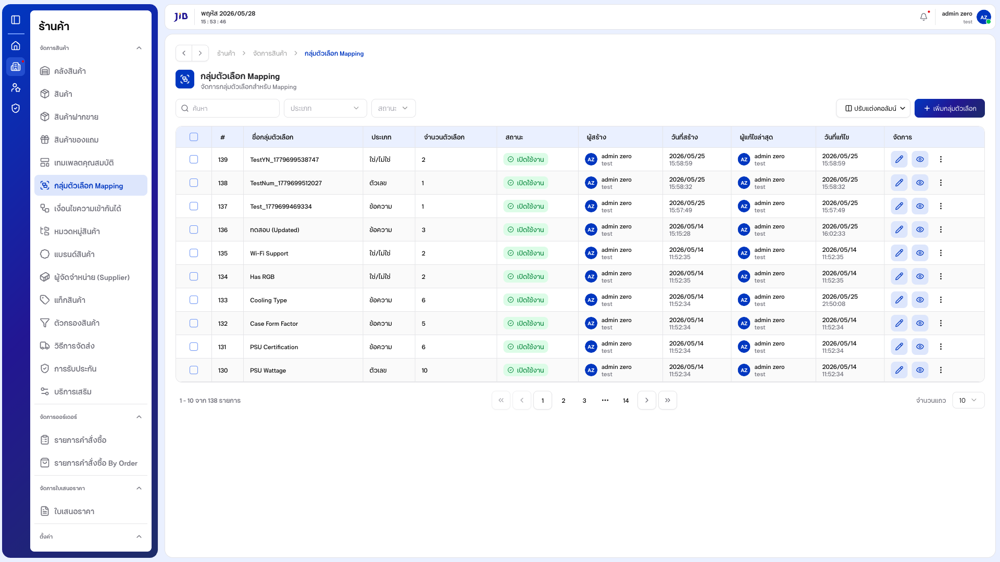
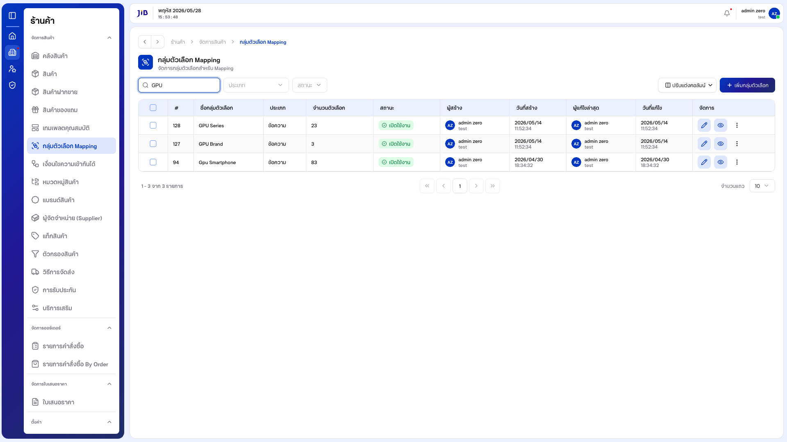
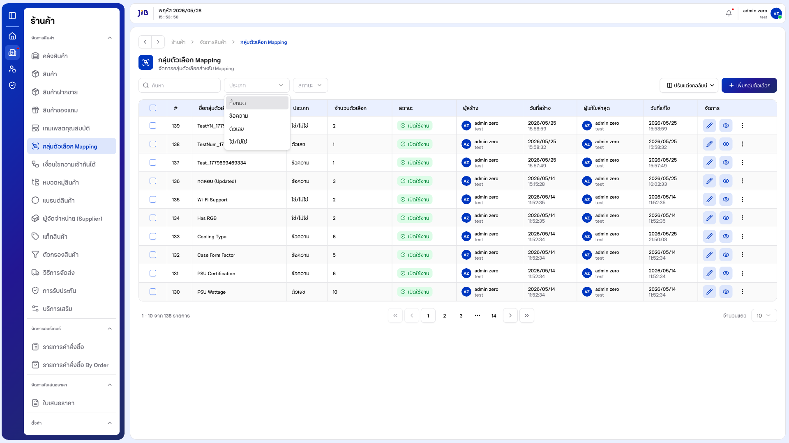
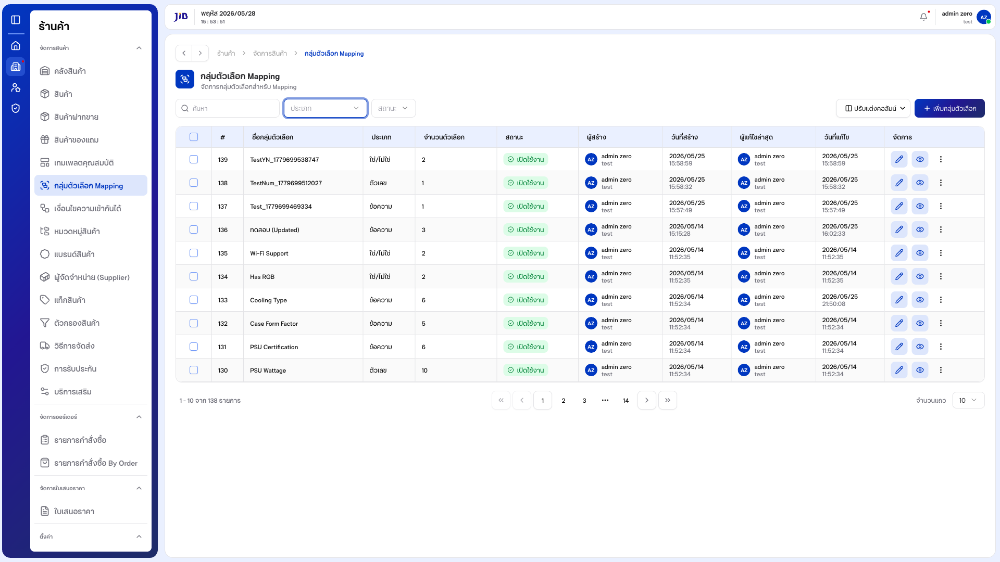
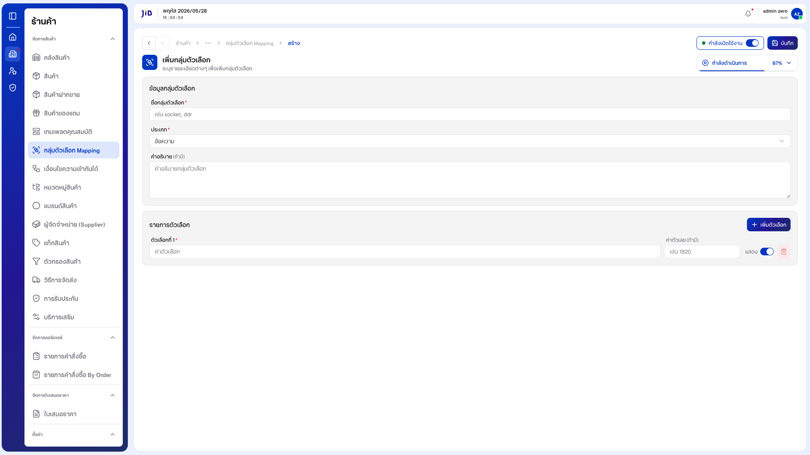
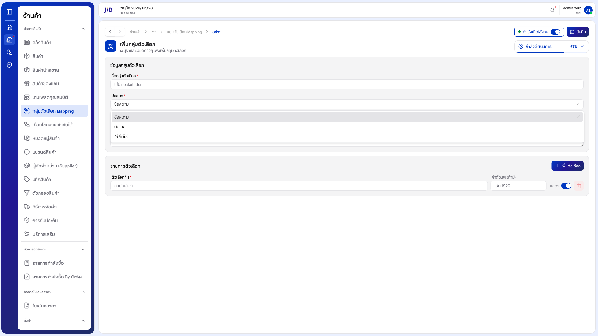
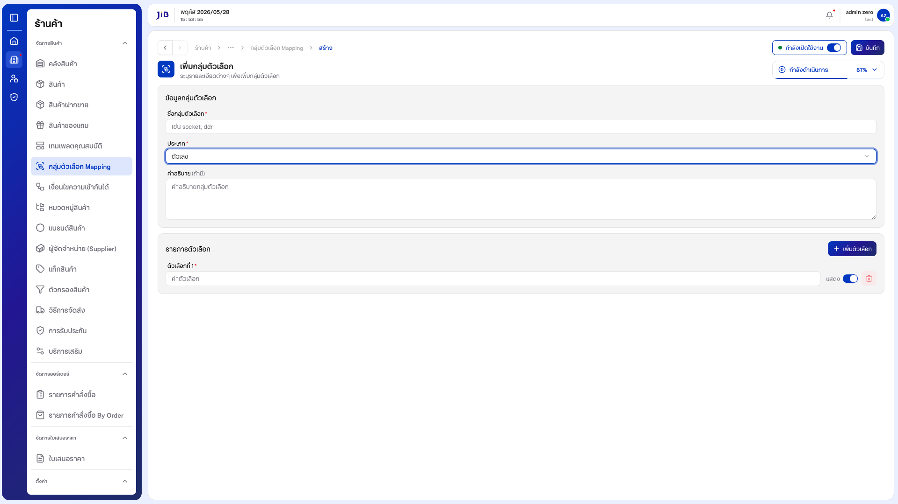
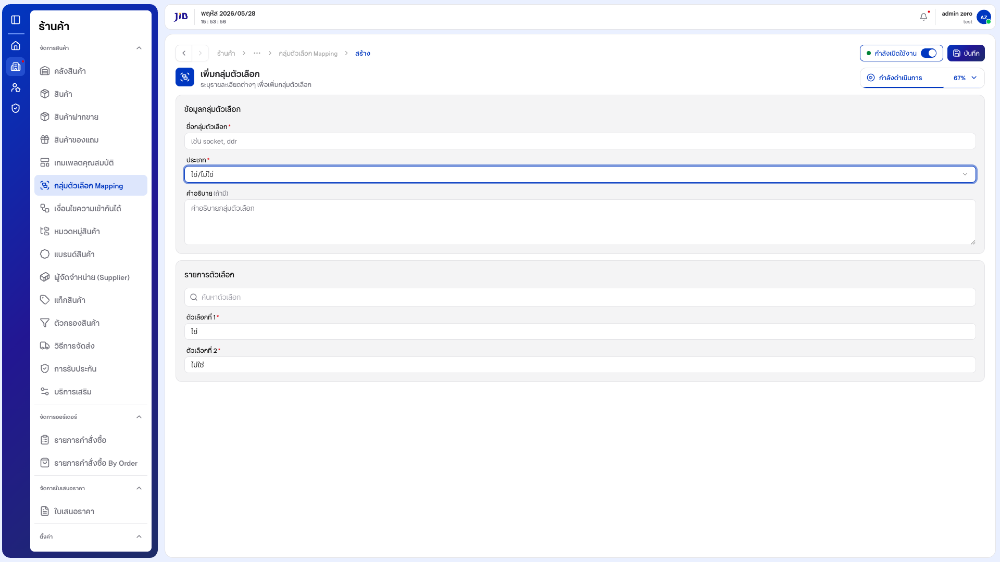
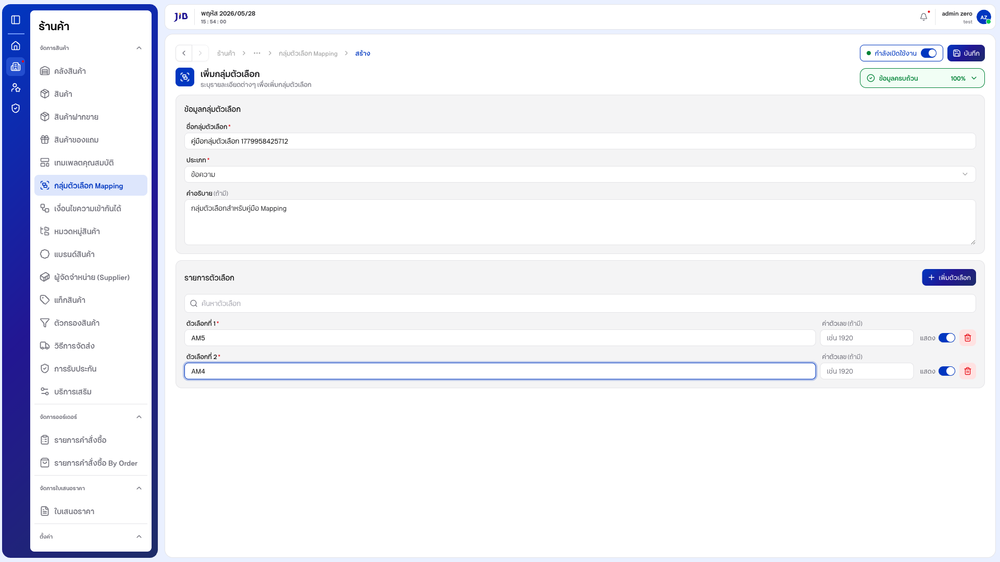
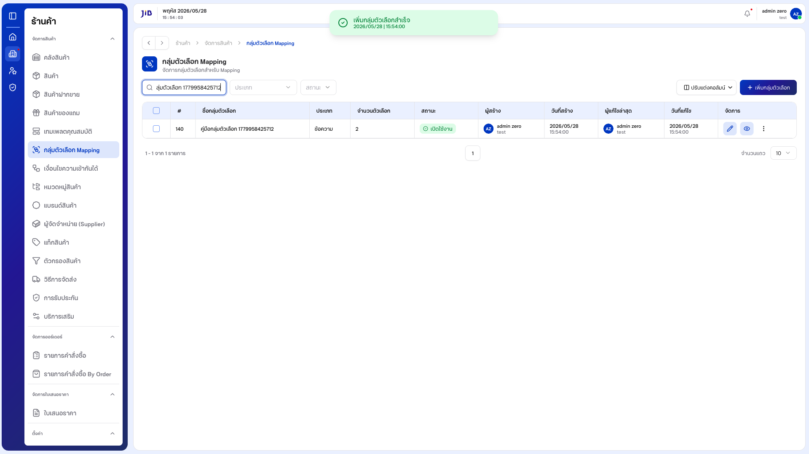

# คู่มือการใช้งาน: กลุ่มตัวเลือก Mapping

**เมนู:** ร้านค้า → จัดการสินค้า → กลุ่มตัวเลือก Mapping  
**URL:** https://devstorex.jibc.codelabdev.co/store/product-manager/template-options

กลุ่มตัวเลือก Mapping ใช้สร้างและจัดการ **ชุดตัวเลือก (options)** ที่นำไปใช้กับเทมเพลตคุณสมบัติสินค้าและ **เงื่อนไขความเข้ากันได้** เช่น Socket ของ CPU (AM5, AM4), ชนิดแรม (DDR4, DDR5) หรือค่าตัวเลข/ใช่-ไม่ใช่ — เพื่อให้ระบบนำไปเทียบความเข้ากันได้ของสินค้าคอมพิวเตอร์

> คู่มือนี้เริ่มที่ **หน้ารายการกลุ่มตัวเลือก** โดยสมมติว่าผู้ใช้เข้าสู่ระบบและเปิดเมนูนี้แล้ว

---

## 1. หน้ารายการกลุ่มตัวเลือก

### 1.1 โครงสร้างหน้าจอรายการ

**1.1.1** หน้ารายการแสดงหัวข้อ **「กลุ่มตัวเลือก Mapping」** พร้อมคำอธิบาย **「จัดการกลุ่มตัวเลือกสำหรับ Mapping」** และตารางกลุ่มตัวเลือกทั้งหมด

**1.1.2** แถบเครื่องมือด้านบนตารางประกอบด้วย ช่อง **「ค้นหา」**, ตัวกรอง **「ประเภท」**, ตัวกรอง **「สถานะ」**, ปุ่ม **「ตัวกรอง」**, **「ปรับแต่งคอลัมน์」** และ **「+ เพิ่มกลุ่มตัวเลือก」**

**1.1.3** คอลัมน์หลักในตาราง ได้แก่ #, ชื่อกลุ่มตัวเลือก, ประเภท, คำอธิบาย, จำนวนตัวเลือก, สถานะ, ผู้สร้าง, วันที่สร้าง, ผู้แก้ไขล่าสุด, วันที่แก้ไข, จัดการ

**หน้าจอรายการกลุ่มตัวเลือก**



---

### 1.2 การค้นหา

**1.2.1** คลิกช่อง **「ค้นหา」** แล้วพิมพ์ชื่อกลุ่มตัวเลือกที่ต้องการ (รองรับทั้งภาษาไทยและอังกฤษ)

**1.2.2** ระบบกรองรายการในตารางให้อัตโนมัติ หากไม่พบจะแสดง **「ไม่พบข้อมูล」** / **「0 - 0 จาก 0 รายการ」**

**หน้าจอการค้นหา**



---

### 1.3 การกรองตามประเภทและสถานะ

**1.3.1** คลิกตัวกรอง **「ประเภท」** เพื่อเลือกกรองตามชนิดของกลุ่มตัวเลือก:

| ตัวเลือก | ความหมาย |
|----------|----------|
| **ทั้งหมด** | แสดงทุกประเภท |
| **ข้อความ** | กลุ่มตัวเลือกแบบข้อความ |
| **ตัวเลข** | กลุ่มตัวเลือกแบบตัวเลข |
| **ใช่/ไม่ใช่** | กลุ่มตัวเลือกแบบ Boolean |

**1.3.2** คลิกตัวกรอง **「สถานะ」** เพื่อเลือก **ทั้งหมด / เปิดใช้งาน / ปิดใช้งาน**

**หน้าจอตัวกรองประเภท**



---

### 1.4 ปรับแต่งคอลัมน์

**1.4.1** คลิกปุ่ม **「ปรับแต่งคอลัมน์」** — ระบบเปิดรายการคอลัมน์ทั้งหมด

**1.4.2** ติ๊ก/ยกเลิกติ๊กเพื่อแสดงหรือซ่อนคอลัมน์ที่ต้องการ

**หน้าจอปรับแต่งคอลัมน์**



---

## 2. การสร้างกลุ่มตัวเลือก

### 2.1 เปิดหน้าสร้างและกรอกข้อมูล

**2.1.1** จากหน้ารายการ คลิกปุ่ม **「+ เพิ่มกลุ่มตัวเลือก」** — ระบบเปิดหน้า **「เพิ่มกลุ่มตัวเลือก」** พร้อมคำอธิบาย **「ระบุรายละเอียดต่างๆ เพื่อเพิ่มกลุ่มตัวเลือก」**

**2.1.2** หน้านี้แบ่งเป็น 2 ส่วน: **「ข้อมูลกลุ่มตัวเลือก」** (ชื่อ, ประเภท, คำอธิบาย) และ **「รายการตัวเลือก」** มุมขวาบนมีแถบ **「กำลังดำเนินการ %」** แสดงความคืบหน้าการกรอกข้อมูล

**หน้าจอสร้างกลุ่มตัวเลือก — ภาพรวม**



---

**2.1.3** กรอก **ชื่อกลุ่มตัวเลือก** (บังคับ) เช่น "Socket", "DDR"

**2.1.4** (ทางเลือก) กรอก **คำอธิบาย**

---

### 2.2 เลือกประเภทของกลุ่มตัวเลือก

**2.2.1** คลิกฟิลด์ **「ประเภท」** — มีให้เลือก 3 ประเภท (ค่าเริ่มต้นคือ **ข้อความ**)

**หน้าจอเลือกประเภท**



---

**2.2.2** ลักษณะของ **「รายการตัวเลือก」** จะเปลี่ยนตามประเภทที่เลือก:

| ประเภท | ลักษณะรายการตัวเลือก |
|--------|----------------------|
| **ข้อความ** | กรอกค่าตัวเลือกเป็นข้อความ + ช่อง **ค่าตัวเลข (ถ้ามี)** + สวิตช์ **แสดง** + ปุ่ม **เพิ่มตัวเลือก** |
| **ตัวเลข** | กรอกค่าตัวเลือกเป็นตัวเลข + สวิตช์ **แสดง** + ปุ่ม **เพิ่มตัวเลือก** |
| **ใช่/ไม่ใช่** | มี 2 ตัวเลือกตายตัว **「ใช่」** และ **「ไม่ใช่」** (แก้ไขไม่ได้) + ช่องค้นหาตัวเลือก ไม่มีปุ่มเพิ่ม |

**หน้าจอประเภท「ตัวเลข」**



**หน้าจอประเภท「ใช่/ไม่ใช่」**



> **หมายเหตุ:** หากเปลี่ยนประเภทหลังจากกรอกค่าตัวเลือกแล้ว ระบบจะ**ล้างค่าตัวเลือกเดิมอัตโนมัติ**

---

### 2.3 จัดการรายการตัวเลือกย่อย (ประเภทข้อความ/ตัวเลข)

**2.3.1** กรอกค่าใน **「ตัวเลือกที่ 1」** (บังคับ)

**2.3.2** คลิกปุ่ม **「+ เพิ่มตัวเลือก」** เพื่อเพิ่มตัวเลือกที่ 2, 3, ... ตามต้องการ

**2.3.3** คลิกไอคอน **ถังขยะ** ท้ายแถวเพื่อลบตัวเลือกนั้น (ปุ่มลบจะถูกปิดใช้งานเมื่อเหลือเพียง 1 ตัวเลือก — ต้องมีอย่างน้อย 1 รายการ)

**2.3.4** สวิตช์ **「แสดง」** ท้ายแต่ละตัวเลือกใช้กำหนดว่าจะแสดงตัวเลือกนั้นหรือไม่ (สำหรับประเภทข้อความสามารถใส่ **ค่าตัวเลข** กำกับได้)

**หน้าจอกรอกข้อมูลครบ (ประเภทข้อความ)**



---

### 2.4 ตั้งสถานะและบันทึก

**2.4.1** สวิตช์ **「กำลังเปิดใช้งาน」** (มุมขวาบน) ค่าเริ่มต้นเปิดอยู่ — ปิดหากต้องการสร้างในสถานะปิดใช้งาน

**2.4.2** คลิกปุ่ม **「บันทึก」**

**2.4.3** เมื่อสำเร็จ ระบบแจ้ง **「เพิ่มกลุ่มตัวเลือกสำเร็จ」** และนำกลับ **หน้ารายการ** — ค้นหาชื่อที่เพิ่งสร้างเพื่อยืนยันว่าปรากฏในตาราง

**หน้าจอรายการหลังบันทึกสำเร็จ**



---

## 3. การจัดการรายการในตาราง

### 3.1 ปรับจำนวนแถวและ Pagination

**3.1.1** ที่ **「จำนวนแถว」** เลือก **10**, **20**, **50** หรือ **100**

**3.1.2** ใช้แถบ Pagination ด้านล่าง (รูปแบบ **「X - Y จาก Z รายการ」**) เพื่อเปลี่ยนหน้า

### 3.2 การแก้ไขและการดำเนินการจากแถว

**3.2.1** คลิกไอคอน **ดินสอ (แก้ไข)** ในคอลัมน์ **「จัดการ」** — ระบบเปิดหน้าแก้ไข (URL `/template-options/update/{id}`) พร้อมข้อมูลเดิม สามารถแก้ไขชื่อ, ประเภท, เพิ่ม/ลบตัวเลือก หรือสถานะ แล้ว **「บันทึก」**

**3.2.2** คลิกปุ่มเมนู (3 จุด / **Open menu**) — มีตัวเลือก **「ปิดการใช้งาน」** และ **「ลบ」**

**3.2.3** ใช้ checkbox หัวตารางเพื่อ **เลือกทุกแถวในหน้า** สำหรับการดำเนินการแบบกลุ่ม

---

## 4. เงื่อนไขและข้อควรระวัง

| ฟิลด์ / กรณี | รายละเอียด |
|--------------|------------|
| ชื่อกลุ่มตัวเลือก | บังคับ — ระบบแจ้ง **「กรุณากรอกชื่อ」** เมื่อเว้นว่าง |
| ประเภท | ค่าเริ่มต้น **ข้อความ** — เปลี่ยนประเภทจะล้างค่าตัวเลือกเดิม |
| ค่าตัวเลือก (ตัวเลือกที่ 1) | บังคับอย่างน้อย 1 รายการ — ระบบแจ้ง **「กรุณากรอกค่า」** |
| ปุ่มลบตัวเลือก | ถูกปิดใช้งานเมื่อเหลือเพียง 1 ตัวเลือก |
| ประเภทใช่/ไม่ใช่ | ตัวเลือกตายตัว (ใช่/ไม่ใช่) แก้ไข/เพิ่มไม่ได้ |
| คำอธิบาย | ไม่บังคับ |
| ออกจากหน้าโดยยังไม่บันทึก | ระบบแสดงคำเตือน (beforeunload) เมื่อมีการแก้ไขค้างอยู่ |
| ความเชื่อมโยง | กลุ่มตัวเลือกนี้ถูกใช้เป็น Template/หัวข้อใน **เงื่อนไขความเข้ากันได้** |

---

### อัปเดตภาพหน้าจอและ PDF

```bash
npm run manual:template-options
```

ภาพ: `docs/images/template-options/` · PDF: `docs/กลุ่มตัวเลือกMapping-คู่มือผู้ใช้.pdf`
