# คู่มือการใช้งาน: ของแถม

**เมนู:** ร้านค้า → จัดการโปรโมชั่น → ของแถม  
**URL:** https://devstorex.jibc.codelabdev.co/store/promotion-manager/free-gifts

ของแถมใช้สร้างและจัดการ **แคมเปญของแถม** เมื่อลูกค้าซื้อสินค้าตามเงื่อนไขที่กำหนด จะได้รับสินค้าแถมหรือคะแนนตามที่ตั้งค่าใน **รายการของแถม** ภายในแคมเปญ

> คู่มือนี้เริ่มที่ **หน้ารายการของแถม** โดยสมมติว่าผู้ใช้เข้าสู่ระบบและเปิดเมนูนี้แล้ว

---

## 1. หน้ารายการของแถม

### 1.1 โครงสร้างหน้าจอรายการ

**1.1.1** หน้ารายการแสดงตารางของแถมทั้งหมด พร้อมช่อง **「ค้นหาชื่อของแถม」**, ปุ่ม **「ตัวกรอง」**, **「ปรับแต่งคอลัมน์」** และ **「+ เพิ่มของแถม」**

**1.1.2** คอลัมน์หลักในตาราง ได้แก่ ชื่อของแถม, วันที่เริ่ม/สิ้นสุด, สถานะการใช้งาน, ของแถมทั้งหมด, ใช้งานอยู่, ปิด/หมด, ผู้สร้าง

**หน้าจอรายการของแถม**

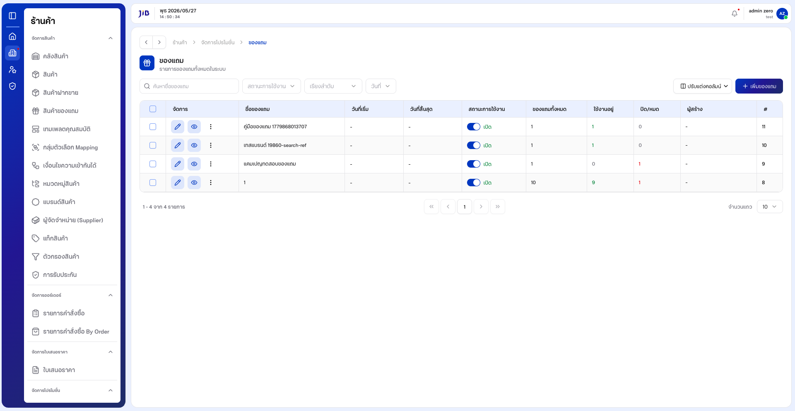

---

### 1.2 การค้นหา

**1.2.1** คลิกช่อง **「ค้นหาชื่อของแถม」** แล้วพิมพ์ชื่อที่ต้องการ

**1.2.2** รอสักครู่ ระบบจะกรองรายการในตาราง

**หน้าจอการค้นหา**

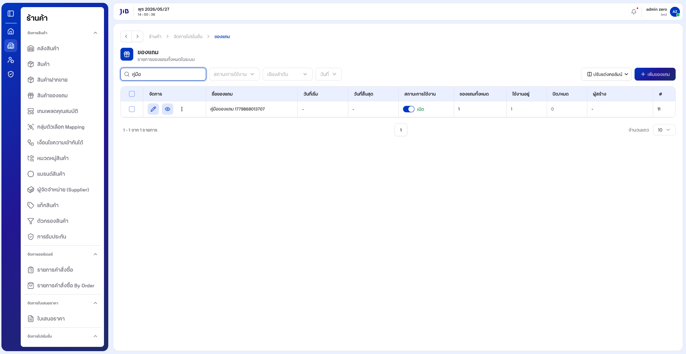

---

### 1.3 การใช้ตัวกรอง

**1.3.1** คลิกปุ่ม **「ตัวกรอง」**

**1.3.2** ตั้งเงื่อนไขในหน้าต่างตัวกรอง แล้วคลิก **「ตกลง」** หรือกด **Esc** / **「ยกเลิก」** เพื่อปิดโดยไม่บันทึก

**หน้าจอแผงตัวกรอง**

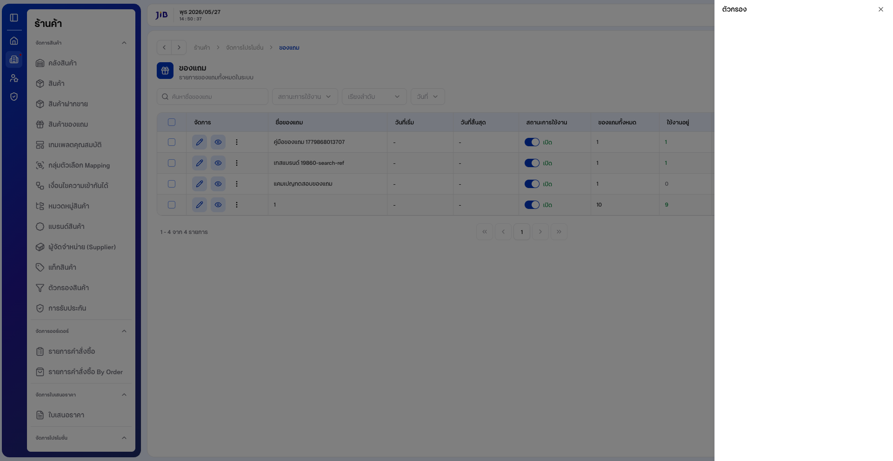

---

## 2. การสร้างแคมเปญของแถม

### 2.1 เปิดหน้าสร้างและกรอกข้อมูลทั่วไป

**2.1.1** จากหน้ารายการ คลิกปุ่ม **「+ เพิ่มของแถม」** — ระบบเปิดหน้า **「เพิ่มแคมเปญของแถม」**

**2.1.2** ส่วน **「ข้อมูลทั่วไป」** ประกอบด้วย ชื่อแคมเปญ, คำอธิบาย, กรอบรูป/ไอคอนแคมเปญ (ไม่บังคับ), และ **ระยะเวลาแคมเปญ**

**หน้าจอสร้างแคมเปญ — ภาพรวม**

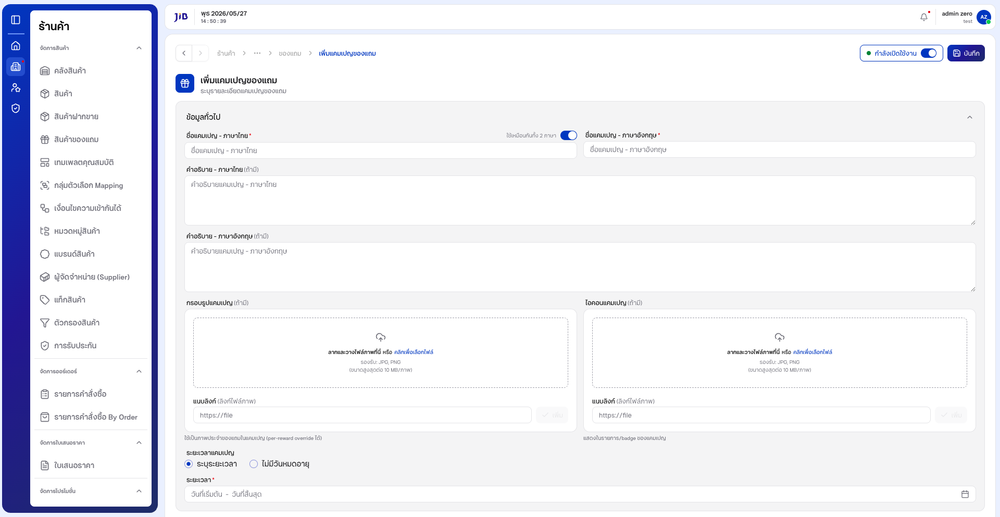

---

**2.1.3** กรอก **ชื่อแคมเปญ - ภาษาไทย** (บังคับ) และ **คำอธิบาย** (ไม่บังคับ)

**2.1.4** ค่าเริ่มต้น **「ใช้เหมือนกันทั้ง 2 ภาษา」** เปิดอยู่ — ชื่อภาษาอังกฤษจะสะท้อนตามภาษาไทย  
หากต้องการกรอกแยก ให้ปิดสวิตช์แล้วกรอกฟิลด์ภาษาอังกฤษ

**หน้าจอกรอกข้อมูลทั่วไป**

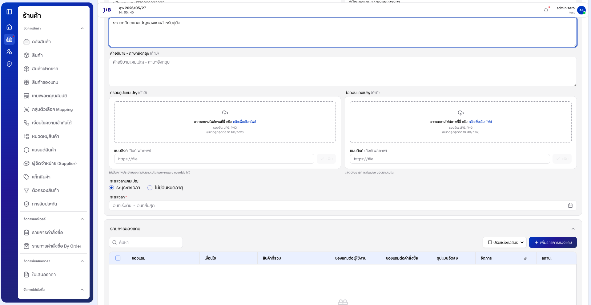

---

**2.1.5** ตั้ง **ระยะเวลาแคมเปญ**:

| ตัวเลือก | ความหมาย |
|----------|----------|
| **ระบุระยะเวลา** | เลือกวันที่เริ่มต้นและสิ้นสุด (ค่าเริ่มต้น) |
| **ไม่มีวันหมดอายุ** | แคมเปญไม่มีวันสิ้นสุด |

**หน้าจอเลือกไม่มีวันหมดอายุ**

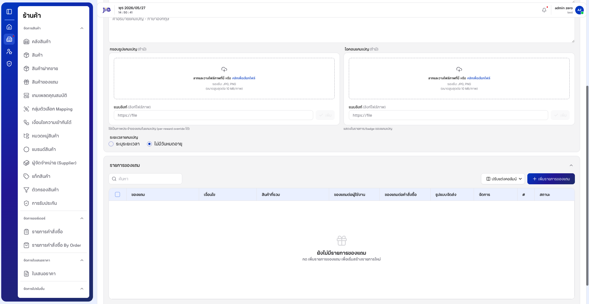

---

### 2.2 เพิ่มรายการของแถม (ฟอร์มรายการเดียวจนจบ)

#### 2.2.1 เริ่มเพิ่มรายการ

**2.2.1.1** ในส่วน **「รายการของแถม」** หากยังไม่มีรายการ ระบบแสดง **「ยังไม่มีรายการของแถม」**

**หน้าจอรายการของแถมว่าง**

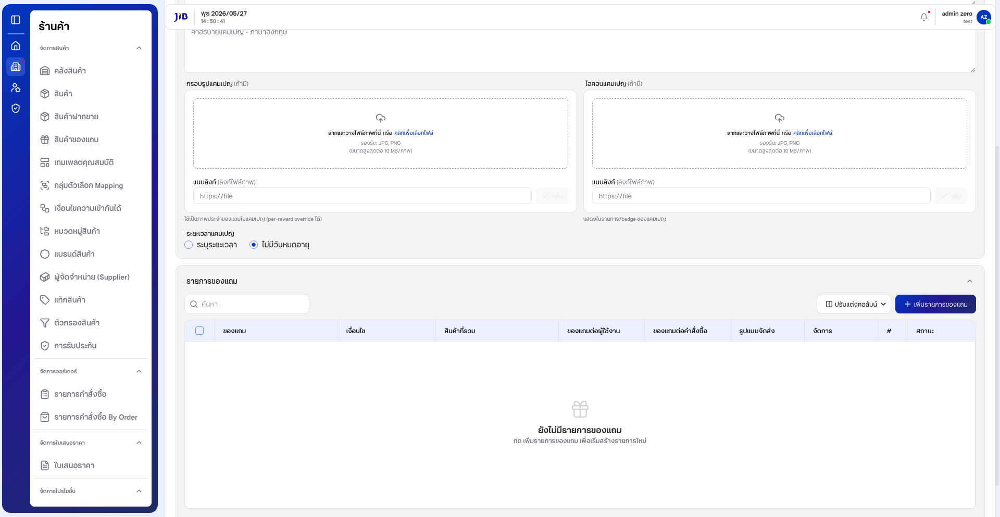

---

**2.2.1.2** คลิกปุ่ม **「+ เพิ่มรายการของแถม」** — ระบบเปิดหน้า **「เพิ่มรายการของแถม」**

**2.2.1.3** หน้านี้แบ่งเป็น 3 ส่วนหลัก:

1. **รายละเอียดของแถม** — เงื่อนไขการได้รับของแถม  
2. **ของแถม** — สินค้าหรือคะแนนที่จะแจก  
3. **สินค้าที่เข้าร่วมของแถม** — กำหนดว่าซื้อสินค้าใดแล้วได้ของแถม

**หน้าจอเพิ่มรายการของแถม — ภาพรวม**

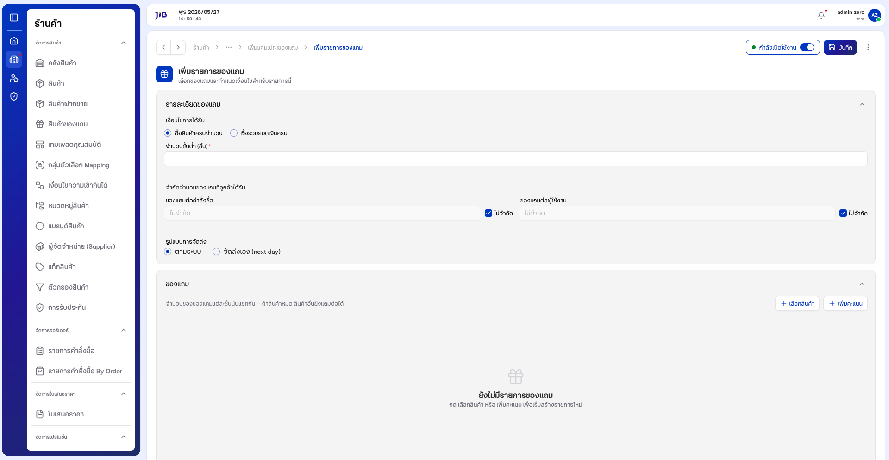

---

#### 2.2.2 ตั้งเงื่อนไขการได้รับของแถม

**2.2.2.1** เลือก **เงื่อนไขการได้รับ**:

| ตัวเลือก | ความหมาย |
|----------|----------|
| **ซื้อสินค้าครบจำนวน** | ลูกค้าต้องซื้อครบจำนวนชิ้นที่กำหนด (ค่าเริ่มต้น) |
| **ซื้อรวมยอดเงินครบ** | ลูกค้าต้องมียอดซื้อรวมครบตามที่กำหนด (บาท) |

**2.2.2.2** กรอก **จำนวนขั้นต่ำ (ชิ้น)** หรือ **ยอดซื้อขั้นต่ำ (บาท)** ตามเงื่อนไขที่เลือก (บังคับ, ต้อง ≥ 1 สำหรับจำนวนชิ้น)

**หน้าจอกรอกจำนวนขั้นต่ำ**

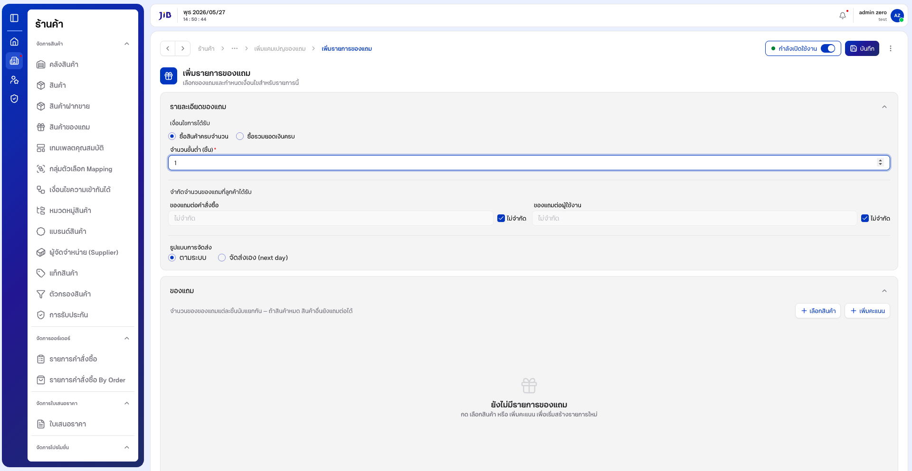

---

**2.2.2.3** กำหนด **จำกัดจำนวนของแถมที่ลูกค้าได้รับ**:

- **ของแถมต่อคำสั่งซื้อ** — จำกัดจำนวนต่อออเดอร์ (ค่าเริ่มต้น **ไม่จำกัด**)  
- **ของแถมต่อผู้ใช้งาน** — จำกัดจำนวนต่อผู้ใช้ (ค่าเริ่มต้น **ไม่จำกัด**)  
- ยกเลิกติ๊ก **「ไม่จำกัด」** หากต้องการระบุตัวเลข

**2.2.2.4** เลือก **รูปแบบการจัดส่ง**:

| ตัวเลือก | ความหมาย |
|----------|----------|
| **ตามระบบ** | ใช้กฎจัดส่งตามระบบ (ค่าเริ่มต้น) |
| **จัดส่งเอง (next day)** | จัดส่งแบบกำหนดเอง |

---

#### 2.2.3 เลือกของแถม (สินค้าที่จะแจก)

**2.2.3.1** ในส่วน **「ของแถม」** หากยังไม่เพิ่มรายการ ระบบแสดง **「ยังไม่มีรายการของแถม」** และข้อความแนะนำให้กด **เลือกสินค้า** หรือ **เพิ่มคะแนน**

**2.2.3.2** หากกด **「บันทึก」** โดยยังไม่เพิ่มของแถม ระบบแจ้ง **「กรุณาเพิ่มของแถมอย่างน้อย 1 รายการ」**

**หน้าจอแจ้งเตือนเมื่อยังไม่เลือกของแถม**

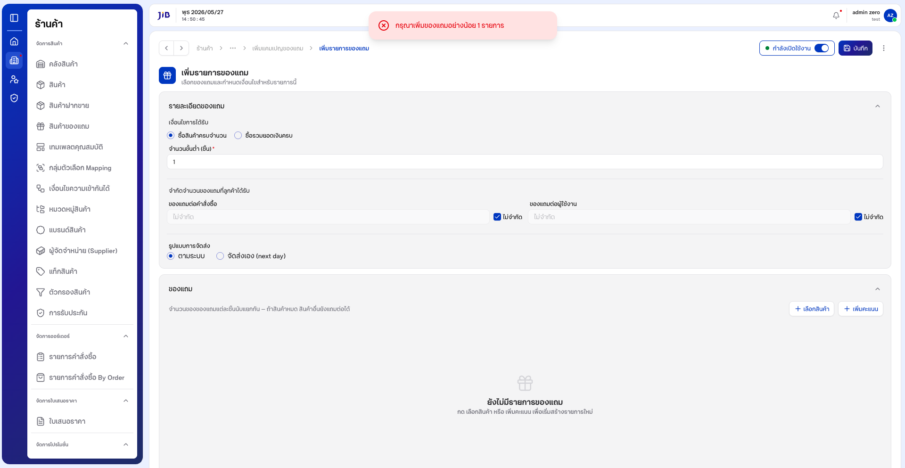

---

**2.2.3.3** คลิกปุ่ม **「+ เลือกสินค้า」** — ระบบเปิดหน้าต่าง **「เลือกสินค้าเป็นของแถม」**

**2.2.3.4** ในหน้าต่างเลือกสินค้า:

1. ใช้ **「ค้นหา」** หรือตัวกรอง (ประเภท / หมวดหมู่ / แบรนด์ / สถานะ)  
2. ติ๊กเลือกสินค้าที่ต้องการแจกเป็นของแถม (เลือกได้หลายรายการ)  
3. คลิก **「เพิ่ม (n)」** — หรือ **「ยกเลิก」** หากไม่ต้องการ

**หน้าจอเลือกสินค้าเป็นของแถม**

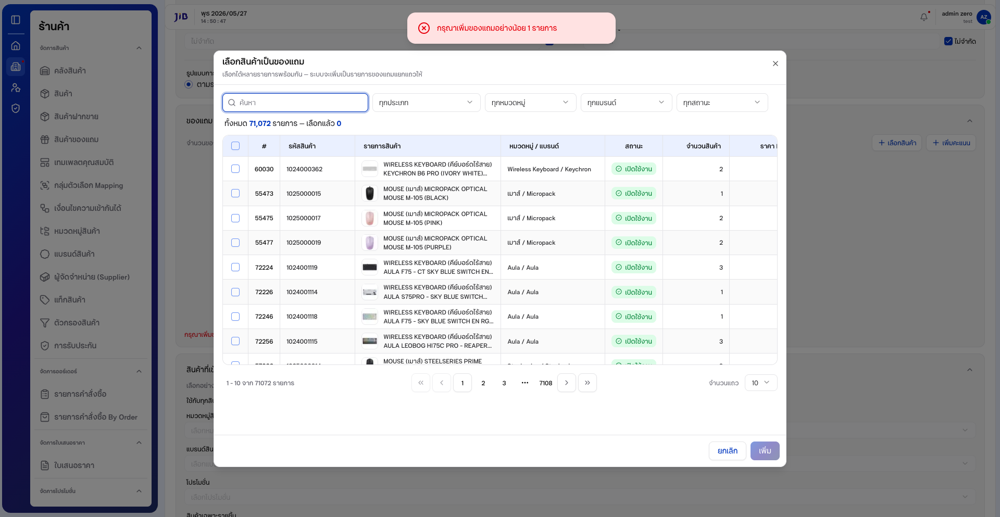

---

**2.2.3.5** หลังเพิ่มสินค้า รายการจะแสดงในตาราง **「ของแถม」** พร้อมคอลัมน์ เช่น รหัสสินค้า, รายการสินค้า, Stock, **จำนวนที่แถมต่อครั้ง**, **จำนวนตลอดแคมเปญ**, สถานะ

**2.2.3.6** ปรับค่าในตารางตามต้องการ:

- **จำนวนที่แถมต่อครั้ง** — จำนวนชิ้นที่แจกต่อครั้ง (ค่าเริ่มต้นมักเป็น 1)  
- **จำนวนตลอดแคมเปญ** — ติ๊ก **「ไม่จำกัด」** หรือระบุจำนวนรวม  
- (ถ้ามี) **ใช้สินค้าจากคลังพิเศษเท่านั้น**  
- เปิดสวิตช์ **「อนุญาตแก้ไขจากตาราง」** หากต้องการแก้ไขในตารางโดยตรง

**2.2.3.7** (ทางเลือก) คลิก **「+ เพิ่มคะแนน」** หากต้องการแจกคะแนนแทนสินค้า

**หน้าจอหลังเพิ่มสินค้าเป็นของแถม**

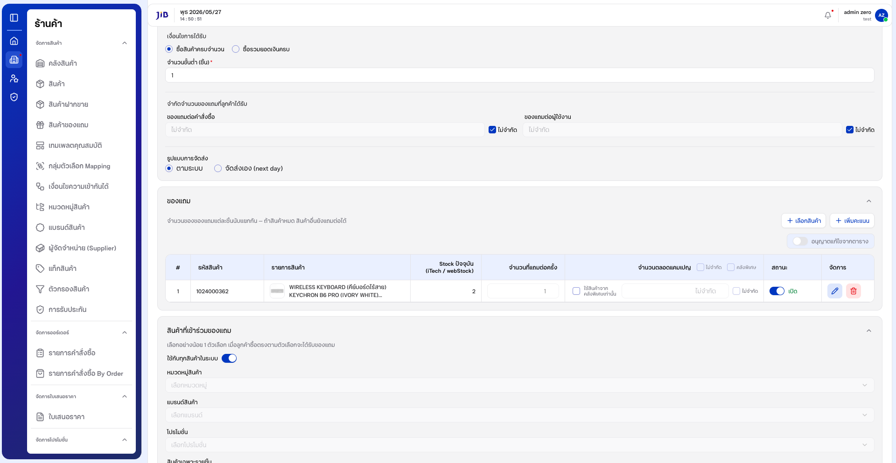

---

#### 2.2.4 กำหนดสินค้าที่เข้าร่วม (เงื่อนไขการซื้อ)

**2.2.4.1** ในส่วน **「สินค้าที่เข้าร่วมของแถม」** ค่าเริ่มต้น **「ใช้กับทุกสินค้าในระบบ」** เปิดอยู่ — ลูกค้าซื้อสินค้าใดก็ได้ตามเงื่อนไขจำนวน/ยอดซื้อ จะได้ของแถม

**2.2.4.2** หากต้องการจำกัดเฉพาะบางกลุ่ม ให้ปิด **「ใช้กับทุกสินค้าในระบบ」** แล้วเลือกอย่างน้อย 1 ตัวเลือก เช่น:

- **หมวดหมู่สินค้า**  
- **แบรนด์สินค้า**  
- **โปรโมชั่น**  
- **สินค้าเฉพาะรายชิ้น**

**2.2.4.3** คลิก **「บันทึก」** (มุมขวาบนของหน้ารายการ) เพื่อบันทึกรายการของแถม

**2.2.4.4** เมื่อสำเร็จ ระบบกลับมาหน้า **「เพิ่มแคมเปญของแถม」** และแจ้ง **「เพิ่มรายการของแถมสำเร็จ」** — รายการจะปรากฏในตาราง **「รายการของแถม」** พร้อมคอลัมน์ เงื่อนไข, สินค้าที่ร่วม, ของแถมที่ได้รับ, รูปแบบจัดส่ง, สถานะ

**หน้าจอแคมเปญหลังเพิ่มรายการสำเร็จ**

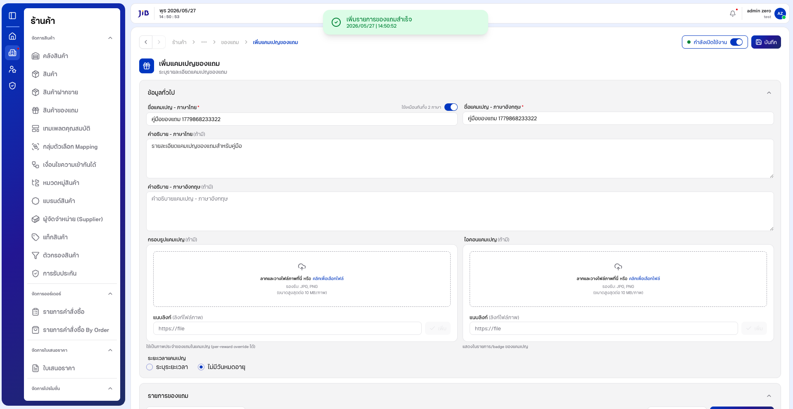

---

### 2.3 บันทึกแคมเปญและตรวจสอบในรายการ

**2.3.1** ตรวจสอบข้อมูลทั่วไปและรายการของแถมในตารางให้ครบ

**2.3.2** คลิกปุ่ม **「บันทึก」** ที่แถบด้านบน

**2.3.3** เมื่อบันทึกสำเร็จ ระบบแจ้ง **「เพิ่มแคมเปญของแถมสำเร็จ」** และนำกลับ **หน้ารายการของแถม**

**2.3.4** ค้นหาชื่อแคมเปญในช่อง **「ค้นหาชื่อของแถม」** เพื่อยืนยันว่าแคมเปญปรากฏในตาราง

**หน้าจอรายการหลังบันทึกสำเร็จ**

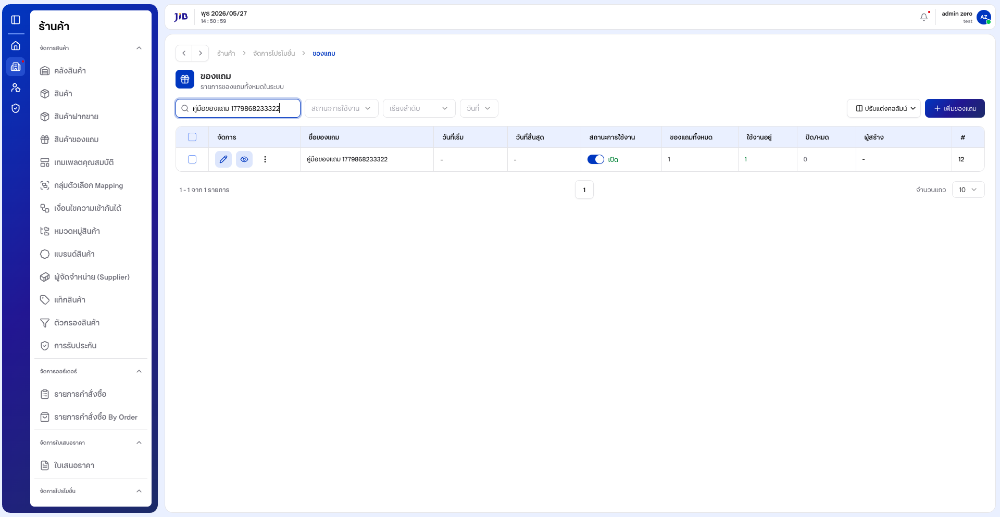

---

## 3. การจัดการรายการในตาราง

### 3.1 ปรับแต่งคอลัมน์และจำนวนแถว

**3.1.1** คลิก **「ปรับแต่งคอลัมน์」** เพื่อเลือกคอลัมน์ที่ต้องการแสดง

**3.1.2** ที่ **「จำนวนแถว」** เลือก **10**, **20**, **50** หรือ **100** ตามต้องการ

**3.1.3** ใช้แถบ Pagination ด้านล่างเพื่อเปลี่ยนหน้า

### 3.2 การดำเนินการจากแถว

**3.2.1** คอลัมน์ **「จัดการ」** มีไอคอน **แก้ไข** และ **ดู** สำหรับเปิดรายละเอียดแคมเปญ

**3.2.2** สลับ **สถานะการใช้งาน** ในตารางเพื่อเปิด/ปิดแคมเปญ

---

## 4. เงื่อนไขและข้อควรระวัง

| ฟิลด์ / กรณี | รายละเอียด |
|--------------|------------|
| ชื่อแคมเปญ (ภาษาไทย) | บังคับก่อนบันทึกแคมเปญ |
| ชื่อแคมเปญ (ภาษาอังกฤษ) | บังคับเมื่อปิด **ใช้เหมือนกันทั้ง 2 ภาษา** |
| จำนวนขั้นต่ำ (ชิ้น) | ต้อง ≥ 1 เมื่อเลือกเงื่อนไขซื้อครบจำนวน |
| ยอดซื้อขั้นต่ำ (บาท) | ต้อง > 0 เมื่อเลือกเงื่อนไขซื้อรวมยอดเงินครบ |
| ของแถมในรายการ | ต้องมีอย่างน้อย 1 รายการ (สินค้าหรือคะแนน) ก่อนบันทึกรายการ |
| สินค้าที่เข้าร่วม | ต้องเลือกอย่างน้อย 1 ตัวเลือก หากปิด **ใช้กับทุกสินค้าในระบบ** |
| บันทึกแคมเปญโดยไม่มีรายการ | ระบบไม่บันทึก — ยังอยู่หน้าสร้าง |
| บันทึกแคมเปญโดยไม่มีรายการ (กรณีพิเศษ) | อาจเกิด **ไม่มีข้อความแจ้งเตือน** และค้างหน้าสร้าง (ข้อจำกัดที่ควรทราบ) |
| จำนวนขั้นต่ำทศนิยม | ระบบอาจรับค่าทศนิยมได้ทั้งที่ไม่ควร (ข้อจำกัดที่ควรทราบ) |
| คำศัพท์ในระบบ | บางจุดใช้ **แคมเปญ** และ **ของแถม** สลับกันในข้อความ |

---

### อัปเดตภาพหน้าจอและ PDF

```bash
npm run manual:free-gifts
```

ภาพ: `docs/images/free-gifts/` · PDF: `docs/ของแถม-คู่มือผู้ใช้.pdf`
