# คู่มือการใช้งาน: คูปอง

**เมนู:** ร้านค้า → จัดการโปรโมชั่น → คูปอง  
**URL:** https://devstorex.jibc.codelabdev.co/store/promotion-manager/coupons

คูปองใช้สร้างและจัดการ **แคมเปญคูปองส่วนลด** โดยแต่ละแคมเปญประกอบด้วยข้อมูลทั่วไป และ **รายการคูปอง** (รายการย่อยภายในแคมเปญ) ที่กำหนดรูปแบบส่วนลด รหัสคูปอง และเงื่อนไขการใช้งานของแต่ละใบ

> คู่มือนี้เริ่มที่ **หน้ารายการคูปอง** โดยสมมติว่าผู้ใช้เข้าสู่ระบบและเปิดเมนูนี้แล้ว

---

## 1. หน้ารายการคูปอง

### 1.1 โครงสร้างหน้าจอรายการ

**1.1.1** หน้ารายการแสดงหัวข้อ **「คูปอง」** พร้อมคำอธิบาย **「รายการคูปองทั้งหมดในระบบ」** และตารางคูปองทั้งหมด

**1.1.2** แถบเครื่องมือด้านบนตารางประกอบด้วย ช่อง **「ค้นหาชื่อคูปอง」**, ปุ่ม **「ตัวกรอง」**, **「ปรับแต่งคอลัมน์」** และ **「+ เพิ่มคูปอง」**

**1.1.3** คอลัมน์หลักในตาราง ได้แก่ #, จัดการ, ชื่อคูปอง, รายการคูปอง, วันที่เริ่ม, วันที่สิ้นสุด, สถานะ, วันที่สร้าง, วันที่แก้ไข, ผู้สร้าง

**หน้าจอรายการคูปอง**

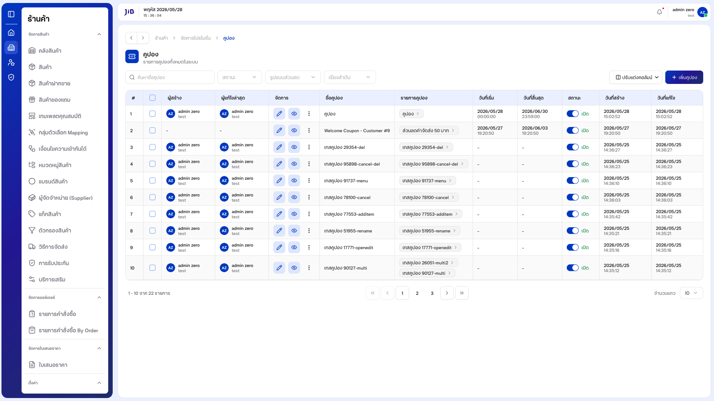

---

### 1.2 การค้นหา

**1.2.1** คลิกช่อง **「ค้นหาชื่อคูปอง」** แล้วพิมพ์ชื่อแคมเปญที่ต้องการ

**1.2.2** รอสักครู่ ระบบจะกรองรายการในตารางให้อัตโนมัติ หากไม่พบจะแสดง **「ไม่พบข้อมูล」**

**หน้าจอการค้นหา**

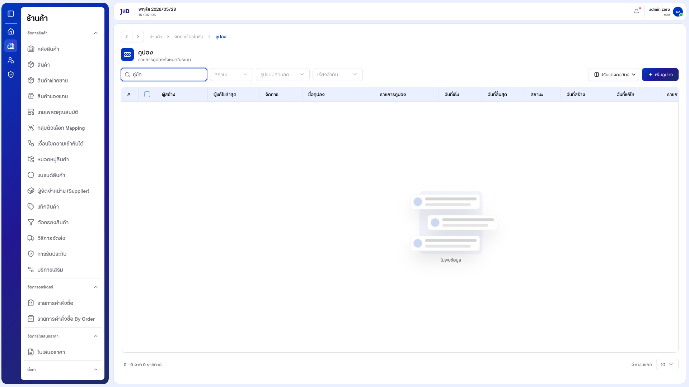

---

### 1.3 การใช้ตัวกรอง

**1.3.1** คลิกปุ่ม **「ตัวกรอง」** — ระบบเปิดแผงตัวกรองด้านข้าง

**1.3.2** ตั้งเงื่อนไขที่ต้องการ แล้วปิดแผงด้วย **「ตกลง」** หรือกด **Esc** / **「ยกเลิก」** เพื่อปิดโดยไม่บันทึก

**หน้าจอแผงตัวกรอง**

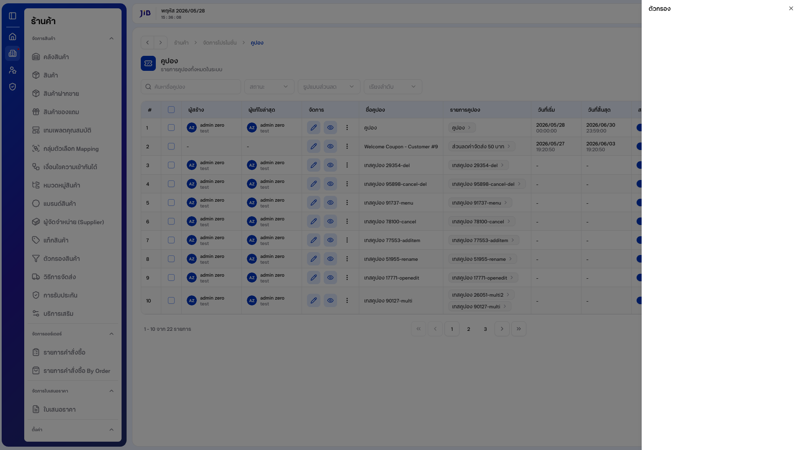

---

## 2. การสร้างแคมเปญคูปอง

### 2.1 เปิดหน้าสร้างและกรอกข้อมูลทั่วไป

**2.1.1** จากหน้ารายการ คลิกปุ่ม **「+ เพิ่มคูปอง」** — ระบบเปิดหน้า **「เพิ่มแคมเปญคูปอง」** พร้อมคำอธิบาย **「ระบุรายละเอียดแคมเปญคูปอง」**

**หน้าจอสร้างแคมเปญ — ภาพรวม**

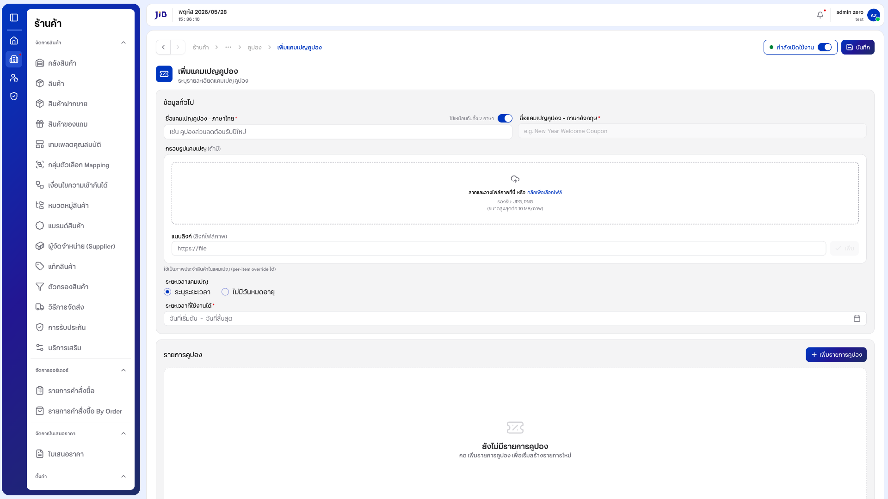

---

**2.1.2** กรอก **ชื่อแคมเปญคูปอง - ภาษาไทย** (บังคับ) เช่น "คูปองส่วนลด..."

**2.1.3** ค่าเริ่มต้น **「ใช้เหมือนกันทั้ง 2 ภาษา」** เปิดอยู่ — ฟิลด์ภาษาอังกฤษถูกล็อกและสะท้อนตามภาษาไทย  
หากต้องการกรอกแยก ให้ปิดสวิตช์แล้วกรอกฟิลด์ **ภาษาอังกฤษ** (จะกลายเป็นฟิลด์บังคับ)

**หน้าจอกรอกชื่อแคมเปญ**

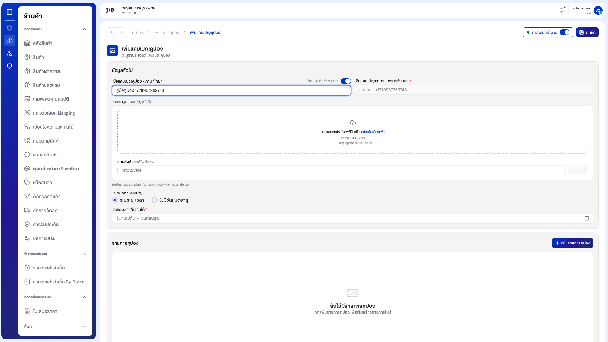

---

**2.1.4** ตั้ง **ระยะเวลาแคมเปญ**:

| ตัวเลือก | ความหมาย |
|----------|----------|
| **ระบุระยะเวลา** | เลือกวันที่เริ่มต้นและสิ้นสุดจากปฏิทิน (ค่าเริ่มต้น) |
| **ไม่มีวันหมดอายุ** | แคมเปญไม่มีวันสิ้นสุด |

**2.1.5** สถานะแคมเปญค่าเริ่มต้นคือ **「กำลังเปิดใช้งาน」**

**หน้าจอเลือกไม่มีวันหมดอายุ**

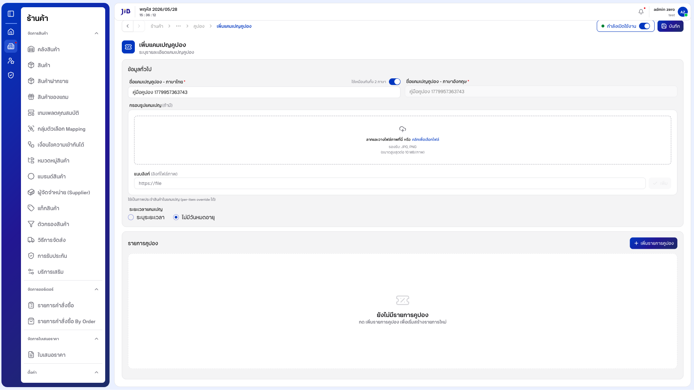

---

### 2.2 เพิ่มรายการคูปอง

#### 2.2.1 เริ่มเพิ่มรายการ

**2.2.1.1** ในส่วน **「รายการคูปอง」** หากยังไม่มีรายการ ระบบแสดง **「ยังไม่มีรายการคูปอง」** และข้อความ **「กด เพิ่มรายการคูปอง เพื่อเริ่มสร้างรายการใหม่」**

**หน้าจอรายการคูปองว่าง**


---

**2.2.1.2** คลิกปุ่ม **「+ เพิ่มรายการคูปอง」** — ระบบเปิดหน้าต่าง **「เพิ่มรายการคูปอง」**

**2.2.1.3** หน้าต่างนี้ประกอบด้วยฟิลด์หลัก:

| ฟิลด์ | รายละเอียด |
|-------|------------|
| **ชื่อรายการคูปอง - ภาษาไทย** | บังคับ |
| **ชื่อรายการคูปอง - ภาษาอังกฤษ** | ใช้ร่วมกับสวิตช์ภาษา |
| **รูปแบบส่วนลด** | เปอร์เซ็นต์ (%) (ค่าเริ่มต้น) หรือ จำนวนเงิน |
| **ประเภทส่วนลด** | กำหนดประเภทการลดราคา |
| **มูลค่าส่วนลด** | ตัวเลขส่วนลด (กรณี % ต้องอยู่ระหว่าง 0–100) |
| **ส่วนลดสูงสุด** | เพดานมูลค่าส่วนลดต่อครั้ง |
| **ยอดซื้อขั้นต่ำ** | ยอดสั่งซื้อขั้นต่ำที่ใช้คูปองได้ |
| **จำนวนชิ้นขั้นต่ำ** | จำนวนสินค้าขั้นต่ำที่ใช้คูปองได้ |
| **รหัสคูปอง** | รหัสเดียว (ค่าเริ่มต้น) หรือ สร้างรหัสอัตโนมัติ |
| **จำนวนการใช้ต่อผู้ใช้** | จำกัดจำนวนครั้งต่อผู้ใช้ |
| **จำนวนการใช้ทั้งหมด** | จำกัดจำนวนครั้งรวมทั้งแคมเปญ |

**หน้าจอเพิ่มรายการคูปอง — ภาพรวม**


---

#### 2.2.2 การตรวจสอบข้อมูล (Validation)

**2.2.2.1** หากกด **「ยืนยัน」** โดยไม่กรอกข้อมูล ระบบแจ้งเตือนฟิลด์บังคับ เช่น **「กรุณากรอกชื่อรายการคูปอง (ภาษาไทย)」** และ **「กรุณากรอกรหัสคูปอง」**

**2.2.2.2** หากกรอก **มูลค่าส่วนลด** แบบเปอร์เซ็นต์เกิน 100 (เช่น 150) ระบบแจ้ง **「ส่วนลดแบบเปอร์เซ็นต์ต้องอยู่ระหว่าง 0 ถึง 100」**

**หน้าจอแจ้งเตือน Validation**

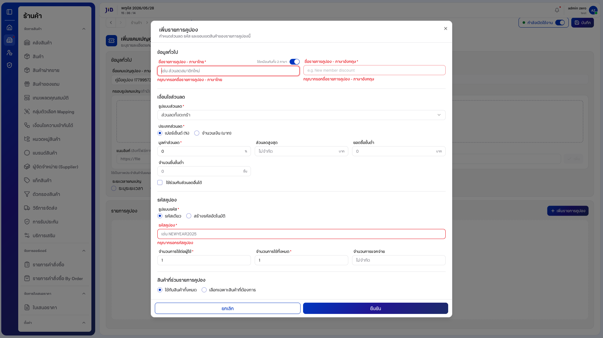

---

#### 2.2.3 กรอกข้อมูลรายการคูปอง

**2.2.3.1** กรอก **ชื่อรายการคูปอง - ภาษาไทย** และ **มูลค่าส่วนลด** (ค่าเริ่มต้นรูปแบบส่วนลดเป็น **เปอร์เซ็นต์ (%)**)

**หน้าจอกรอกข้อมูลรายการคูปอง**

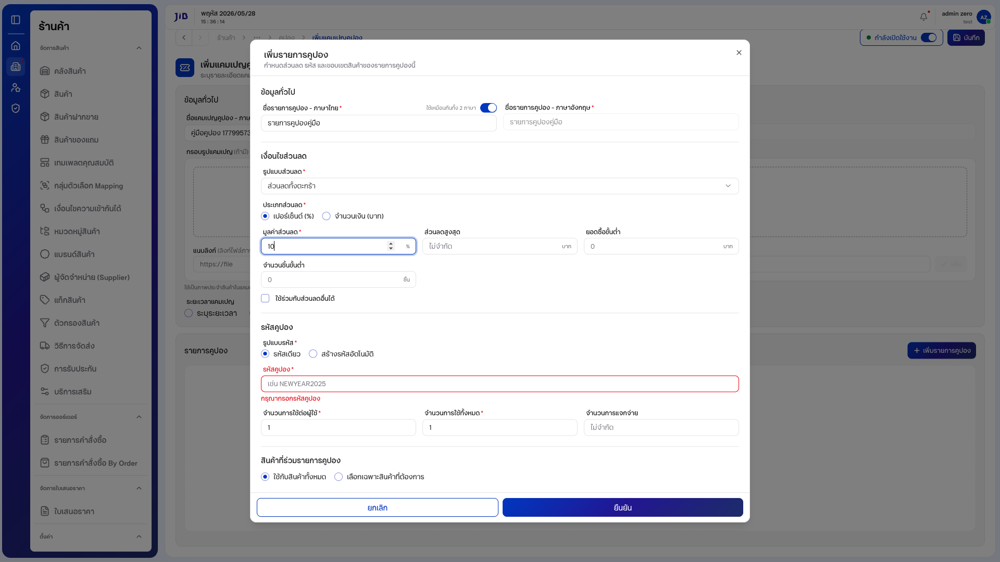

---

**2.2.3.2** ที่ส่วน **「รหัสคูปอง」** มี 2 รูปแบบ:

| ตัวเลือก | ความหมาย |
|----------|----------|
| **รหัสเดียว** | กรอกรหัสคูปองเองเพียงรหัสเดียว (ค่าเริ่มต้น) |
| **สร้างรหัสอัตโนมัติ** | ระบบสร้างหลายรหัส โดยกำหนด **คำนำหน้ารหัส**, **ความยาวส่วนท้าย** และ **ชุดอักขระ** |

**หน้าจอสร้างรหัสอัตโนมัติ**

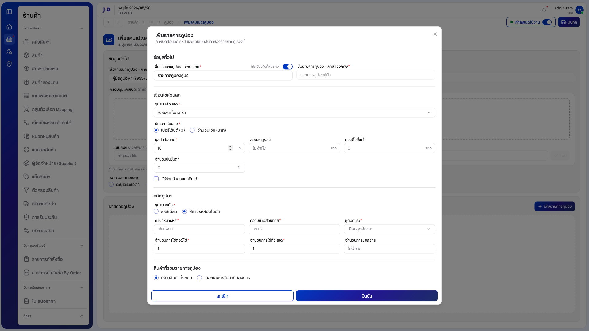

---

**2.2.3.3** ที่ส่วน **ขอบเขตสินค้า** เลือกได้:

| ตัวเลือก | ความหมาย |
|----------|----------|
| **ใช้กับสินค้าทั้งหมด** | คูปองใช้ได้กับทุกสินค้า (ค่าเริ่มต้น) |
| **เลือกเฉพาะสินค้าที่ต้องการ** | เปิดตัวเลือกให้เลือกสินค้าที่ต้องการ (ต้องเลือกอย่างน้อย 1 รายการ) |

**หน้าจอเลือกเฉพาะสินค้าที่ต้องการ**

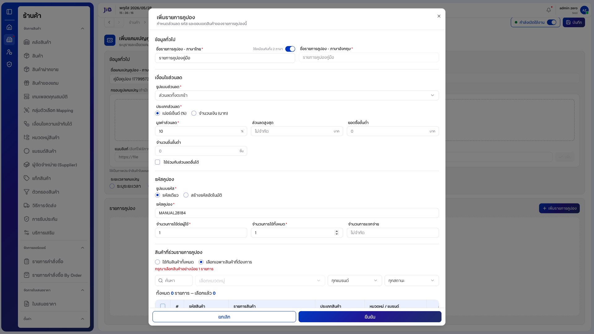

---

**2.2.3.4** เมื่อกรอกครบ คลิก **「ยืนยัน」** — หน้าต่างปิดและรายการคูปองจะปรากฏในตาราง **「รายการคูปอง」** ของแคมเปญ พร้อมชื่อและรหัสคูปอง  
(คลิก **「ยกเลิก」** เพื่อปิดโดยไม่เพิ่มรายการ)

**หน้าจอแคมเปญหลังเพิ่มรายการคูปอง**

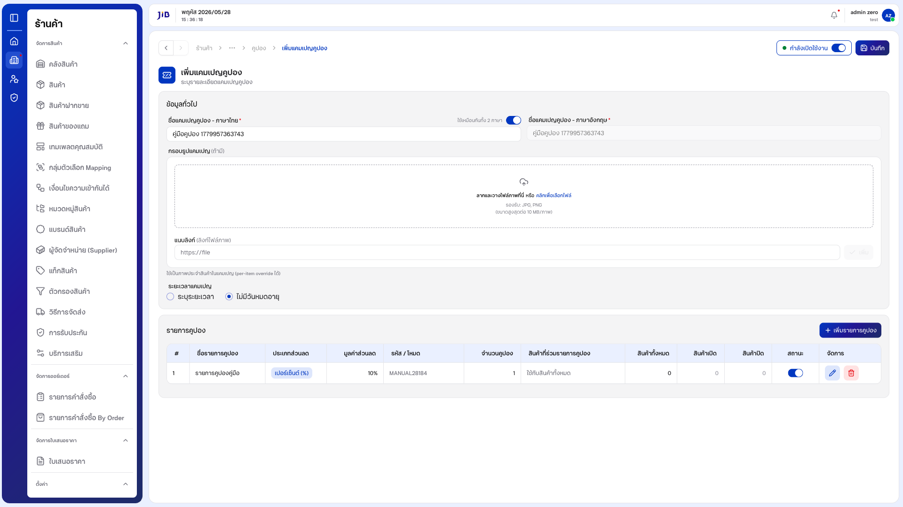

---

### 2.3 บันทึกแคมเปญและตรวจสอบในรายการ

**2.3.1** ตรวจสอบข้อมูลทั่วไปและรายการคูปองในตารางให้ครบ (ต้องมีอย่างน้อย 1 รายการ)

**2.3.2** คลิกปุ่ม **「บันทึก」**

**2.3.3** เมื่อบันทึกสำเร็จ ระบบนำกลับ **หน้ารายการคูปอง**

**2.3.4** ค้นหาชื่อแคมเปญในช่อง **「ค้นหาชื่อคูปอง」** เพื่อยืนยันว่าแคมเปญปรากฏในตาราง

**หน้าจอรายการหลังบันทึกสำเร็จ**

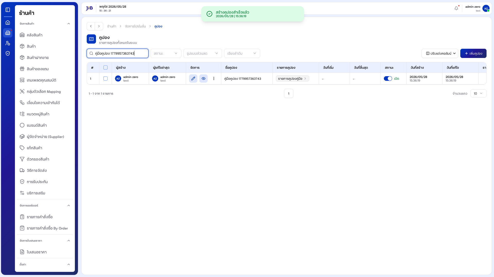

---

## 3. การจัดการรายการในตาราง

### 3.1 ปรับแต่งคอลัมน์และจำนวนแถว

**3.1.1** คลิก **「ปรับแต่งคอลัมน์」** เพื่อเลือกคอลัมน์ที่ต้องการแสดง/ซ่อน

**3.1.2** ที่ **「จำนวนแถว」** เลือก **10**, **20**, **50** หรือ **100** ตามต้องการ

**3.1.3** ใช้แถบ Pagination ด้านล่าง (รูปแบบ **「X - Y จาก Z รายการ」**) เพื่อเปลี่ยนหน้า

### 3.2 การแก้ไขคูปอง

**3.2.1** ที่คอลัมน์ **「จัดการ」** คลิกไอคอนแก้ไขของแถวที่ต้องการ — ระบบเปิดหน้าแก้ไข (URL `/coupons/update/...`) พร้อมแสดง **ID** และ **「บันทึกล่าสุด」**

**3.2.2** แก้ไขชื่อแคมเปญ หรือ **「+ เพิ่มรายการคูปอง」** เพิ่มเติม แล้วคลิก **「บันทึก」**

**3.2.3** หากเปิดหน้าแก้ไขแล้วออกโดยไม่บันทึก (เช่น กลับหน้ารายการ) ค่าเดิมจะไม่ถูกเปลี่ยน

### 3.3 ปิด/เปิดการใช้งาน และลบ

**3.3.1** คลิกปุ่มเมนู (จุดสามจุด / **Open menu**) ที่แถวของรายการ — แสดงเมนู **「ปิดการใช้งาน」** (หรือ **「เปิดการใช้งาน」**) และ **「ลบ」**

**3.3.2** เลือก **「ปิดการใช้งาน」** เพื่อปิดแคมเปญ — รายการยังอยู่ในตารางแต่สถานะเปลี่ยน

**3.3.3** เลือก **「ลบ」** — ระบบแสดงกล่องยืนยัน คลิก **「ลบ」/「ยืนยัน」** เพื่อลบจริง หรือ **「ยกเลิก」** เพื่อยกเลิก

---

## 4. เงื่อนไขและข้อควรระวัง

| ฟิลด์ / กรณี | รายละเอียด |
|--------------|------------|
| ชื่อแคมเปญคูปอง (ภาษาไทย) | บังคับก่อนบันทึกแคมเปญ |
| ชื่อแคมเปญคูปอง (ภาษาอังกฤษ) | บังคับเมื่อปิด **ใช้เหมือนกันทั้ง 2 ภาษา** |
| ชื่อรายการคูปอง (ภาษาไทย) | บังคับในหน้าต่างเพิ่มรายการคูปอง |
| รหัสคูปอง | บังคับเมื่อใช้รูปแบบ **รหัสเดียว** |
| มูลค่าส่วนลด (เปอร์เซ็นต์) | ต้องอยู่ระหว่าง **0 ถึง 100** |
| ขอบเขตสินค้า | ต้องเลือกอย่างน้อย 1 รายการ หากเลือก **เลือกเฉพาะสินค้าที่ต้องการ** |
| รายการคูปองในแคมเปญ | ต้องมีอย่างน้อย 1 รายการ — มิฉะนั้นระบบแจ้ง **「กรุณาเพิ่มรายการคูปองอย่างน้อย 1 รายการ」** |
| บันทึกแคมเปญโดยไม่กรอกข้อมูล | ระบบไม่บันทึก — ยังอยู่หน้าสร้าง |

---

### อัปเดตภาพหน้าจอและ PDF

```bash
npm run manual:coupons
```

ภาพ: `docs/images/coupons/` · PDF: `docs/คูปอง-คู่มือผู้ใช้.pdf`
