# คู่มือการใช้งาน: สินค้า

**เมนู:** ร้านค้า → จัดการสินค้า → สินค้า  
**URL:** https://devstorex.jibc.codelabdev.co/store/product-manager/products

สินค้าเป็นฟังก์ชันหลักของระบบ ใช้สร้างและจัดการสินค้าทั้งหมดในร้าน ตั้งแต่ข้อมูลทั่วไป รูปภาพ คุณสมบัติ คลังสินค้า ราคา แท็ก ตัวกรอง ไปจนถึง SEO โดยรองรับ **3 ประเภทสินค้าพิเศษ** (ชิ้นส่วนคอมพิวเตอร์ / สินค้าตัวเลือก / อุปกรณ์เสริม) และ **10 กลุ่มย่อยในรายการ** (สินค้าปกติ, สินค้าตัวเลือก, ชิ้นส่วนประกอบคอมพิวเตอร์, คอมพิวเตอร์เซ็ต, ซอฟต์แวร์/ดิจิทัล, พรีออเดอร์, ฝากขาย, สินค้าใหม่, ถังขยะ)

> คู่มือนี้เริ่มที่ **หน้ารายการสินค้า** โดยสมมติว่าผู้ใช้เข้าสู่ระบบและเปิดเมนูนี้แล้ว

---

## 1. หน้ารายการสินค้า

### 1.1 โครงสร้างหน้าจอ

**1.1.1** หน้ารายการแสดงหัวข้อ **「สินค้า」** + คำอธิบาย **「จัดการสินค้าในระบบ」** พร้อมตารางสินค้าทั้งหมด (รองรับข้อมูลขนาดใหญ่ — เกินกว่า 70,000 รายการ)

**1.1.2** **Tab Filter ด้านบน (10 tabs)** สำหรับกรองตามประเภทสินค้า:
- **ทั้งหมด** — แสดงทุกสินค้า
- **สินค้าปกติ** — สินค้าทั่วไป
- **สินค้าตัวเลือก** — สินค้าที่มี variants (รุ่น/สเปค/สี)
- **สินค้าชิ้นส่วนประกอบคอมพิวเตอร์** — ชิ้นส่วนที่ใช้ประกอบเซ็ต
- **คอมพิวเตอร์เซ็ต** — คอมเซ็ตประกอบ
- **สินค้าซอฟต์แวร์/ดิจิทัล** — สินค้าดิจิทัล
- **สินค้าพรีออเดอร์** — สั่งจองล่วงหน้า
- **สินค้าฝากขาย** — สินค้าจาก supplier
- **สินค้าใหม่** — เพิ่งเข้าระบบ
- **ถังขยะ** — สินค้าที่ถูกลบ (soft delete)

**1.1.3** **คอลัมน์ในตาราง (รวม ~34 คอลัมน์)** ครอบคลุม: อัพเดท Spec, SKU, สินค้า, สถานะสินค้า, สถานะการขาย, การเชื่อมต่อ ITECH, ประเภทสินค้า, ตัวเลือกสินค้า, แบรนด์, สต๊อก, ราคา (ITECH/กำหนดเอง), Supplier, หมวดหมู่ (หลัก/รอง/สินค้า), จัดการ ฯลฯ

**1.1.4** แถบเครื่องมือ: ช่อง **「ค้นหา」**, ปุ่ม **「ตัวกรอง」**, **「ปรับแต่งคอลัมน์」**, **「+ เพิ่มสินค้า」**

**หน้าจอรายการสินค้า**

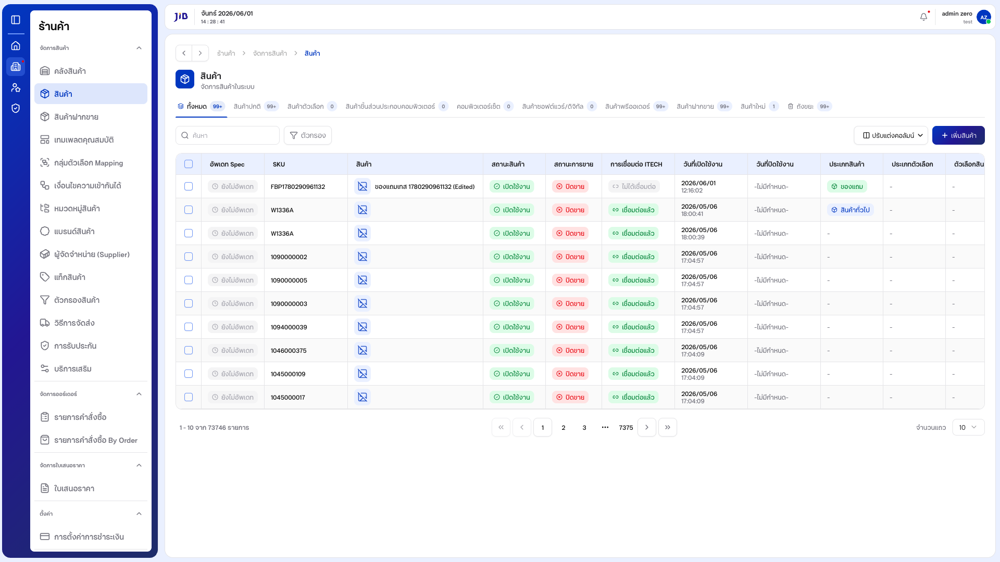

---

### 1.2 การค้นหา

**1.2.1** คลิกช่อง **「ค้นหา」** แล้วพิมพ์ keyword (รองรับชื่อสินค้า TH/EN, SKU, ตัวเลข) — ระบบเพิ่ม `?search=` ใน URL อัตโนมัติ

**1.2.2** หากไม่พบจะแสดง **「ไม่พบข้อมูล」** / **「0 - 0 จาก 0 รายการ」**

**หน้าจอการค้นหา**

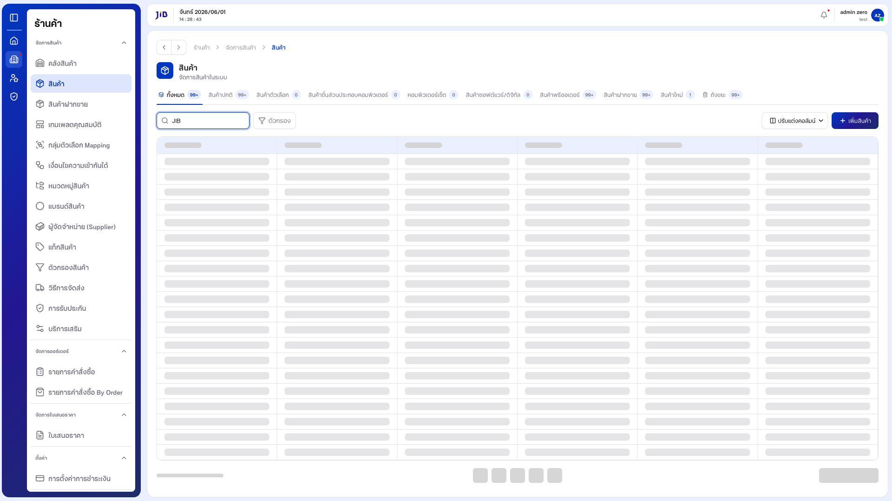

---

### 1.3 การใช้ตัวกรอง

**1.3.1** คลิกปุ่ม **「ตัวกรอง」** — ระบบเปิดแผงตัวกรองด้านข้างสำหรับตั้งเงื่อนไขขั้นสูง

**1.3.2** กด **「ตกลง」** หรือ **Esc** เพื่อปิด

**หน้าจอแผงตัวกรอง**

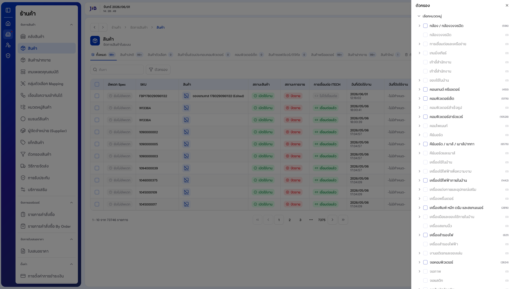

---

### 1.4 ปรับแต่งคอลัมน์

**1.4.1** คลิกปุ่ม **「ปรับแต่งคอลัมน์」** — แสดง dropdown ของคอลัมน์ทั้งหมด สามารถติ๊ก/ยกเลิกติ๊กเพื่อซ่อน/แสดง

**1.4.2** ปิด dropdown ด้วย **Esc**

**หน้าจอปรับแต่งคอลัมน์**


---

### 1.5 Tab ถังขยะ (Trash / Soft Delete)

**1.5.1** คลิกแท็บ **「ถังขยะ」** เพื่อดูสินค้าที่ถูกลบไปแล้ว (soft delete — ยังกู้คืนได้)

**1.5.2** สามารถ search ใน trash หรือกู้คืน/ลบถาวรจากแถวได้

**หน้าจอ Tab ถังขยะ**

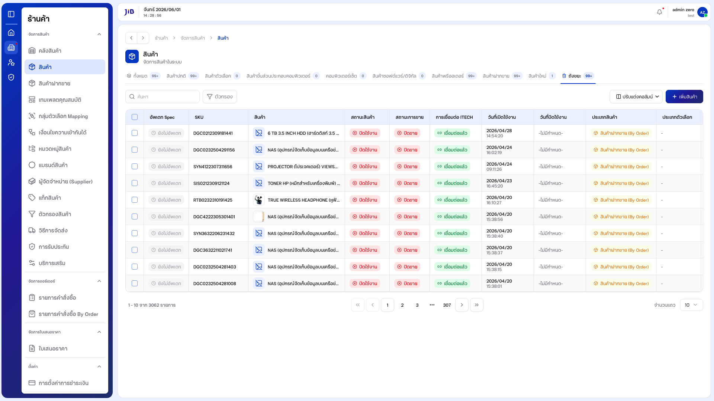

---

### 1.6 การจัดการแถว (Row Actions)

**1.6.1** ที่คอลัมน์ **「จัดการ」**:
- ไอคอน **ดินสอ (แก้ไข)** — เปิดหน้าแก้ไข (`/products/update/{id}`)
- ปุ่ม **3 จุด (Open menu)** — เปิดเมนู: **ปิดการใช้งาน / เปิดการใช้งาน** และ **ลบ**

**1.6.2** เลือก **「ปิด/เปิดการใช้งาน」** เพื่อสลับสถานะการขาย

**1.6.3** เลือก **「ลบ」** → ระบบแสดง dialog ยืนยัน → คลิก **「ลบ」** เพื่อย้ายไปถังขยะ

**หน้าจอเมนู 3-จุด**

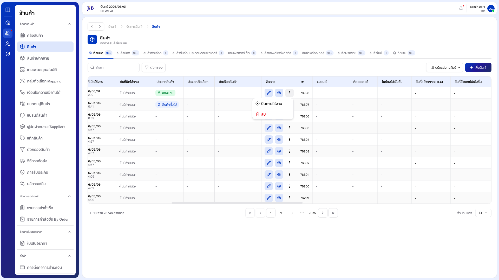

---

## 2. การสร้างสินค้า (Create)

จากหน้ารายการ คลิก **「+ เพิ่มสินค้า」** — ระบบเปิดหน้า **「เพิ่มสินค้าใหม่」** ซึ่งแบ่งเป็น **8 sections** ผ่าน tabs ด้านบน + แสดง **Preview Card** ของสินค้า real-time + แถบ **「ดำเนินการ %」** วัดความคืบหน้า

**หน้าจอสร้างสินค้า — ภาพรวม**

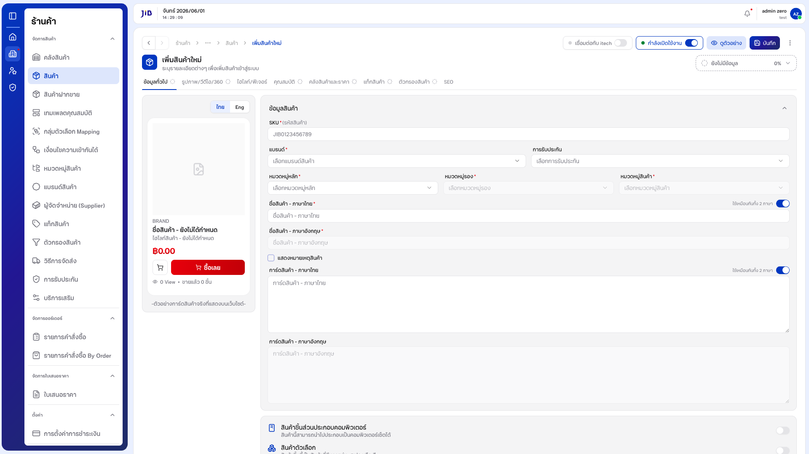

---

### 2.1 Section 1: ข้อมูลทั่วไป

**2.1.1** กรอก **SKU (รหัสสินค้า)** (บังคับ) เช่น `JIB0123456789`

**2.1.2** เลือก **แบรนด์** (บังคับ) จาก dropdown

**2.1.3** เลือก **การรับประกัน** (ไม่บังคับ)

**2.1.4** เลือก **หมวดหมู่หลัก / หมวดหมู่รอง / หมวดหมู่สินค้า** (บังคับทั้ง 3) — ต้องเลือก **หมวดหมู่หลัก** ก่อน จึงจะเลือก **หมวดหมู่รอง** ได้

**2.1.5** กรอก **ชื่อสินค้า - ภาษาไทย** (บังคับ) และ **ภาษาอังกฤษ** (บังคับ)
- สวิตช์ **「ใช้เหมือนกันทั้ง 2 ภาษา」** เปิดอยู่เป็นค่าเริ่มต้น → EN จะ sync ตาม TH
- ปิดสวิตช์เพื่อกรอก EN แยก

**2.1.6** กรอก **การ์ดสินค้า (Highlight)** TH/EN — แสดงในการ์ดสินค้าหน้าเว็บไซต์ (ไม่บังคับ มี sync toggle แยก)

**2.1.7** ตั้ง **ขนาดและน้ำหนัก** (2 ชุด — สินค้า + รวมพัสดุ):
- น้ำหนัก (kg)
- ความกว้าง / ความยาว / ความสูง (cm)

**2.1.8** เปิด/ปิด **「แสดงหมายเหตุสินค้า」** ตามต้องการ

**หน้าจอ section ข้อมูลทั่วไป**

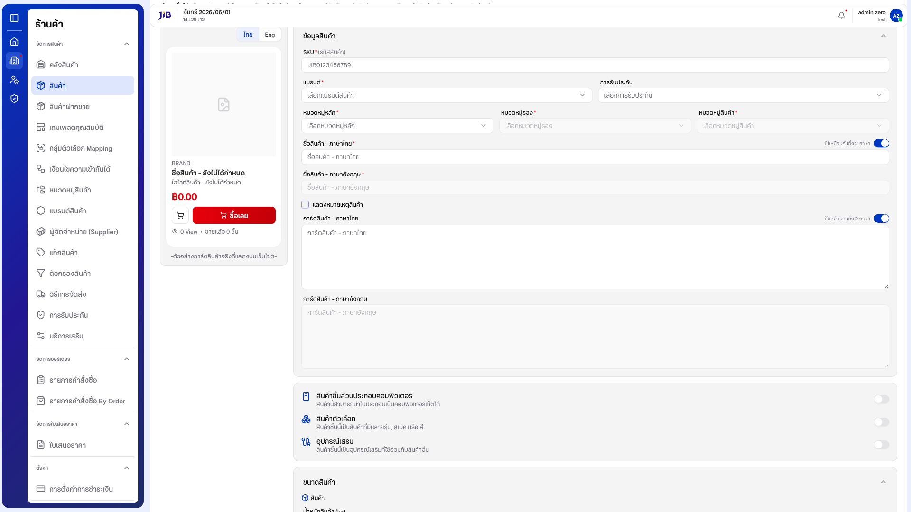

---

### 2.2 Section 2: รูปภาพ / วีดีโอ / 360

**2.2.1** คลิก tab **「รูปภาพ/วีดีโอ/360」** — แสดง drop zone

**2.2.2** **「ลากและวางไฟล์ภาพที่นี่ หรือ คลิกเพื่อเลือกไฟล์」** — รองรับ **JPG, PNG** (ขนาดสูงสุด 10 MB/ภาพ)

**2.2.3** อัปโหลดได้หลายรูป + จัดลำดับด้วย drag-and-drop

**2.2.4** ลบรูปแต่ละไฟล์ได้

**หน้าจอ section รูปภาพ**

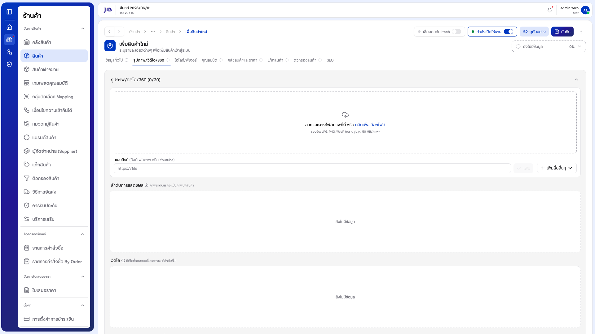

---

### 2.3 Section 3: ไฮไลท์/ฟีเจอร์

**2.3.1** เพิ่มข้อมูล **ฟีเจอร์เด่นของสินค้า** TH/EN — แสดงบนหน้าสินค้าในเว็บไซต์

**2.3.2** สามารถเพิ่ม/ลบ feature items ได้หลายรายการ

**หน้าจอ section ไฮไลท์**

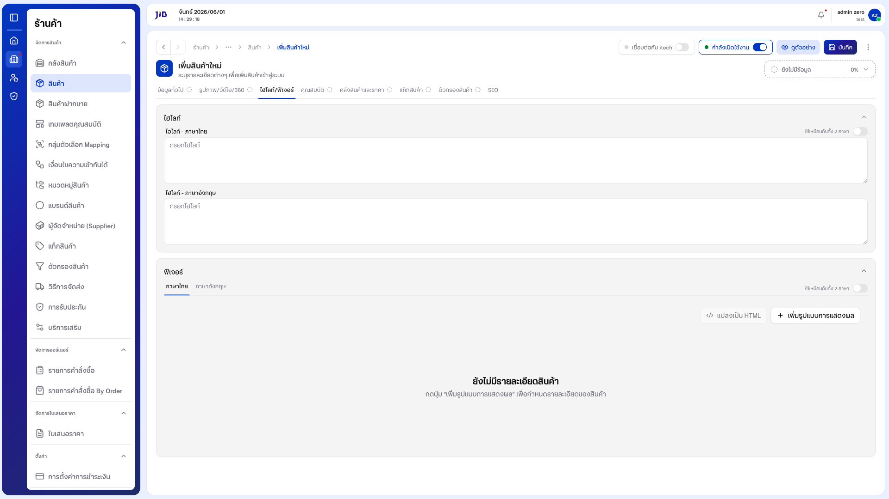

---

### 2.4 Section 4: คุณสมบัติ (Attributes)

**2.4.1** เลือก **เทมเพลตคุณสมบัติ** (กำหนดจากเมนู [เทมเพลตคุณสมบัติ](#)) — ฟอร์มจะ render ฟิลด์คุณสมบัติตาม template

**2.4.2** กรอกค่าคุณสมบัติ เช่น CPU Socket, RAM Type, Watt ฯลฯ (ตามที่ template กำหนด)

**หน้าจอ section คุณสมบัติ**

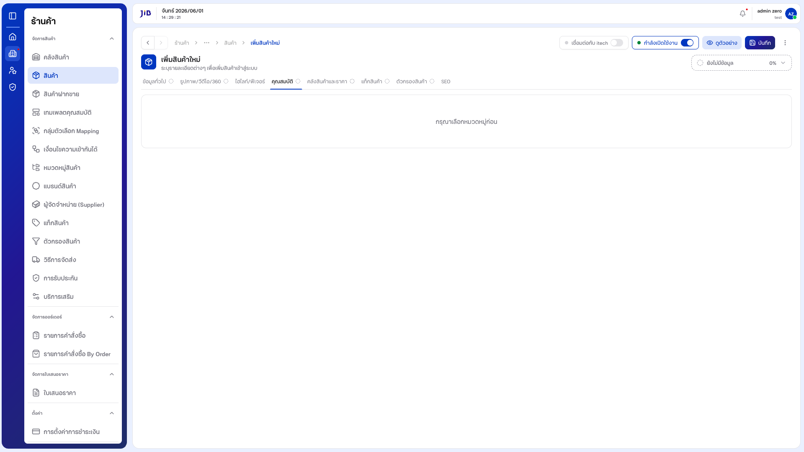

---

### 2.5 Section 5: คลังสินค้าและราคา

**2.5.1** **ราคา** — กรอกราคาขาย (รองรับทศนิยม)

**2.5.2** **Stock** — จำนวนสินค้าในคลัง

**2.5.3** **ราคา ITECH** + **ส่วนลด** + **ราคากำหนดเอง** — สำหรับสินค้าที่เชื่อมต่อ ITECH

**2.5.4** **Supplier + Supplier Code** — กรณีเป็นสินค้าฝากขาย

**2.5.5** **ราคาในช่วงโปรโมชั่น** — อัพเดทอัตโนมัติเมื่อสินค้าอยู่ใน promotion campaign

**หน้าจอ section คลังสินค้า**

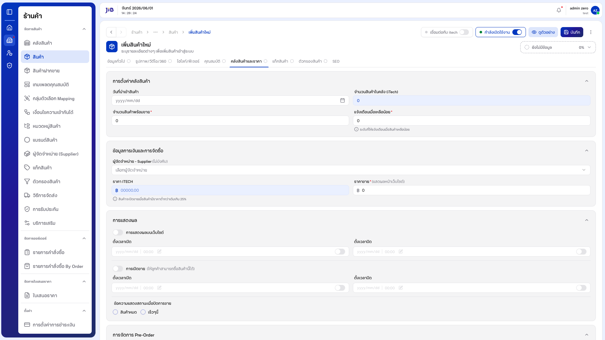

---

### 2.6 Section 6: แท็กสินค้า

**2.6.1** เลือก **แท็กสินค้า** (สร้างจากเมนู [แท็กสินค้า](#)) — เลือกได้หลายแท็ก

**2.6.2** ลบ tag ออกได้ด้วยปุ่ม X ในแต่ละแท็ก

**หน้าจอ section แท็ก**

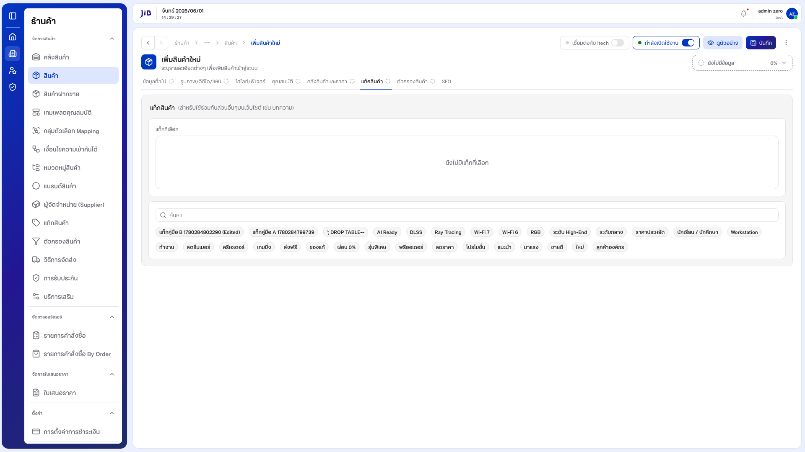

---

### 2.7 Section 7: ตัวกรองสินค้า (Product Filters)

**2.7.1** เลือก **ตัวกรองสินค้า** (สร้างจากเมนู [ตัวกรองสินค้า](#)) — กำหนดค่า filter values ที่จะใช้กรองในหน้าเว็บไซต์

**2.7.2** เช่น สี: แดง/ดำ/ขาว, ขนาด: S/M/L

**หน้าจอ section ตัวกรอง**

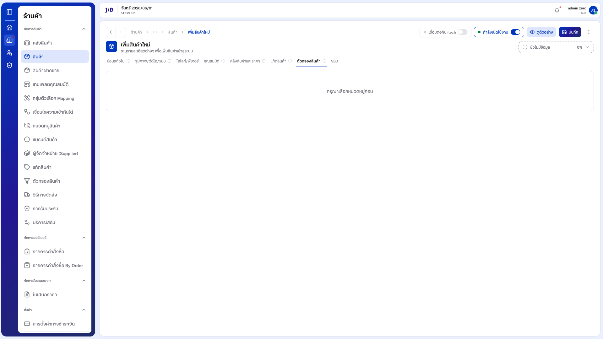

---

### 2.8 Section 8: SEO

**2.8.1** กรอก **Meta Title** TH/EN — แสดงในผลค้นหา Google

**2.8.2** กรอก **Meta Description** TH/EN

**2.8.3** กรอก **Slug / URL** ของสินค้า

**2.8.4** กรอก **Meta Keywords**

**หน้าจอ section SEO**

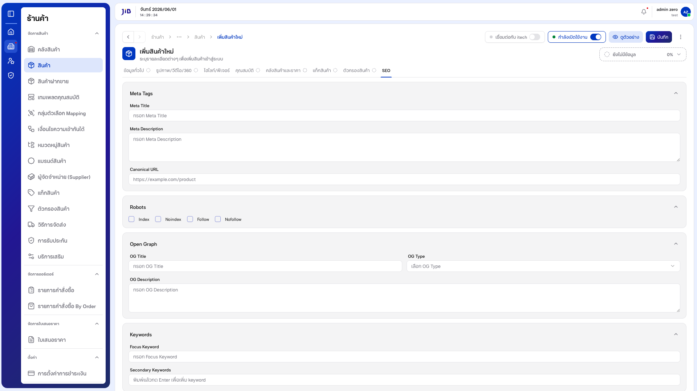

---

### 2.9 ประเภทสินค้าพิเศษ (3 toggles)

ภายใต้ section **「ข้อมูลทั่วไป」** มีสวิตช์ 3 ประเภทพิเศษ (ปิดเป็นค่าเริ่มต้น):

| Toggle | ความหมาย |
|--------|----------|
| **สินค้าชิ้นส่วนประกอบคอมพิวเตอร์** | สินค้านี้สามารถนำไปประกอบเป็นคอมพิวเตอร์เซ็ตได้ |
| **สินค้าตัวเลือก** | สินค้าชิ้นนี้เป็นสินค้าที่มีหลายรุ่น, สเปค หรือ สี (variants) |
| **อุปกรณ์เสริม** | สินค้าชิ้นนี้เป็นอุปกรณ์เสริมที่ใช้ร่วมกับสินค้าอื่น |

---

### 2.10 บันทึกสินค้า

**2.10.1** แถบขวาบนแสดง **「ดำเนินการ %」** — ติดตามความคืบหน้าการกรอก (เริ่ม 0% → เพิ่มเรื่อยๆ → 100% เมื่อกรอกครบ)

**2.10.2** คลิกปุ่ม **「ดูตัวอย่าง」** เพื่อดู preview สินค้าเสมือนหน้าเว็บ

**2.10.3** คลิกปุ่ม **「บันทึก」** เพื่อบันทึกสินค้า

**2.10.4** หากกรอกข้อมูลไม่ครบฟิลด์บังคับ ระบบจะแจ้ง **「กรุณากรอก...」** ใต้แต่ละฟิลด์ที่ขาด

**2.10.5** เมื่อบันทึกสำเร็จ ระบบแจ้ง **「เพิ่มสินค้าสำเร็จ」** + redirect กลับ **หน้ารายการสินค้า**

---

## 3. การแก้ไขสินค้า

**3.1** จากหน้ารายการ คลิกไอคอน **ดินสอ** ในคอลัมน์ **「จัดการ」** → URL `/products/update/{id}`

**3.2** ระบบโหลดข้อมูลเดิม + แสดง progress ตามฟิลด์ที่กรอก (เช่น **「ข้อมูลครบถ้วน 100%」** หากกรอกครบ)

**3.3** แก้ไขฟิลด์ใดก็ได้ในทุก section แล้วคลิก **「บันทึก」**

**3.4** หากออกจากหน้าโดยไม่บันทึก ระบบจะแสดงคำเตือน (beforeunload)

**หน้าจอแก้ไขสินค้า**

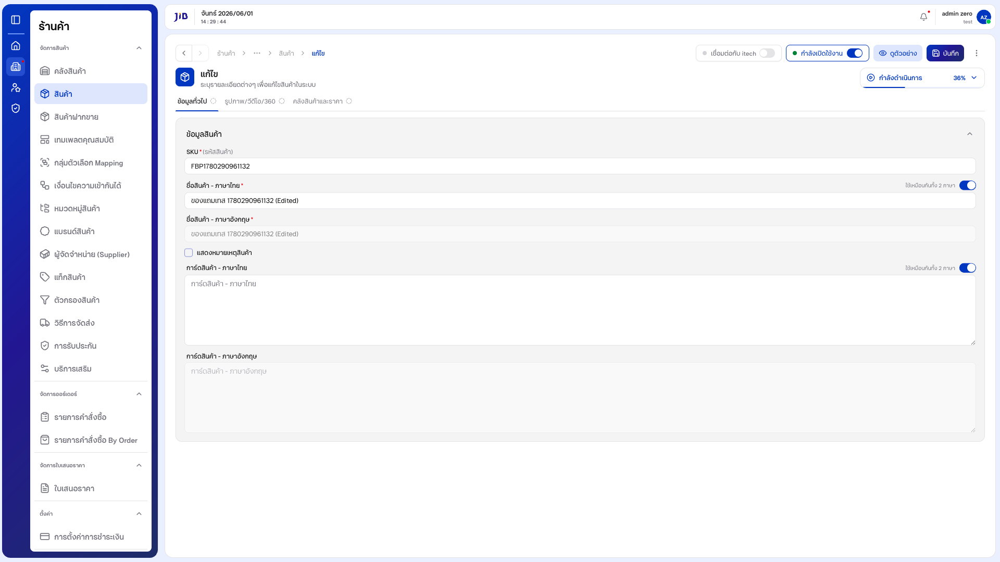

---

## 4. การจัดการในตาราง

### 4.1 ปรับแต่งจำนวนแถว

**4.1.1** เลือก **「จำนวนแถว」** = **10**, **20**, **50**, **100**

**4.1.2** ดู Pagination ด้านล่าง (รูปแบบ **「X - Y จาก Z รายการ」**)

### 4.2 การลบสินค้า

**4.2.1** เปิดเมนู 3-จุด → **「ลบ」** → ยืนยัน → สินค้าจะถูกย้ายไป **「ถังขยะ」** (soft delete)

**4.2.2** ใน tab **「ถังขยะ」** สามารถกู้คืนหรือลบถาวรได้

### 4.3 การเปิด/ปิดการใช้งาน

**4.3.1** เปิดเมนู 3-จุด → **「ปิดการใช้งาน」** / **「เปิดการใช้งาน」** เพื่อเปลี่ยนสถานะการขาย

---

## 5. เงื่อนไขและข้อควรระวัง

| ฟิลด์ / กรณี | รายละเอียด |
|--------------|------------|
| SKU (รหัสสินค้า) | บังคับ — ระบบแจ้ง error เมื่อเว้นว่าง |
| ชื่อสินค้า (TH/EN) | บังคับทั้ง 2 ภาษา (EN sync จาก TH หากเปิด toggle) |
| แบรนด์ | บังคับ — ต้องเลือกจาก dropdown |
| หมวดหมู่หลัก / รอง / สินค้า | บังคับทั้ง 3 — ต้องเลือก main ก่อนจึงเลือก sub ได้ |
| ราคา | บังคับ — รับทศนิยม / ปฏิเสธค่าลบ |
| ฟิลด์ชื่อรับเกิน 256 ตัวอักษร | ไม่มี maxLength client-side — ต้อง verify backend limit |
| space-only ในฟิลด์ชื่อ | ไม่ trim client-side — backend ต้อง validate |
| รูปภาพ | รองรับ JPG/PNG ขนาดสูงสุด 10 MB/ภาพ |
| ออกจากหน้าโดยยังไม่บันทึก | แสดง beforeunload warning |
| Tabs ประเภทสินค้า | 10 tabs + count บนปุ่ม (เช่น "ทั้งหมด 99+", "ถังขยะ 99+") |
| URL `/update/{invalid-id}` | render หน้า Edit-like ฟอร์มเปล่า (Bug — ควร 404/redirect) |
| Soft Delete | ลบสินค้าจะย้ายไป **ถังขยะ** ไม่ลบถาวรทันที |

---

### อัปเดตภาพหน้าจอและ PDF

```bash
node scripts/capture-products-screenshots.js
node scripts/generate-manual-pdf.js สินค้า-คู่มือผู้ใช้.md
```

ภาพ: `docs/images/products/` · PDF: `docs/สินค้า-คู่มือผู้ใช้.pdf`
