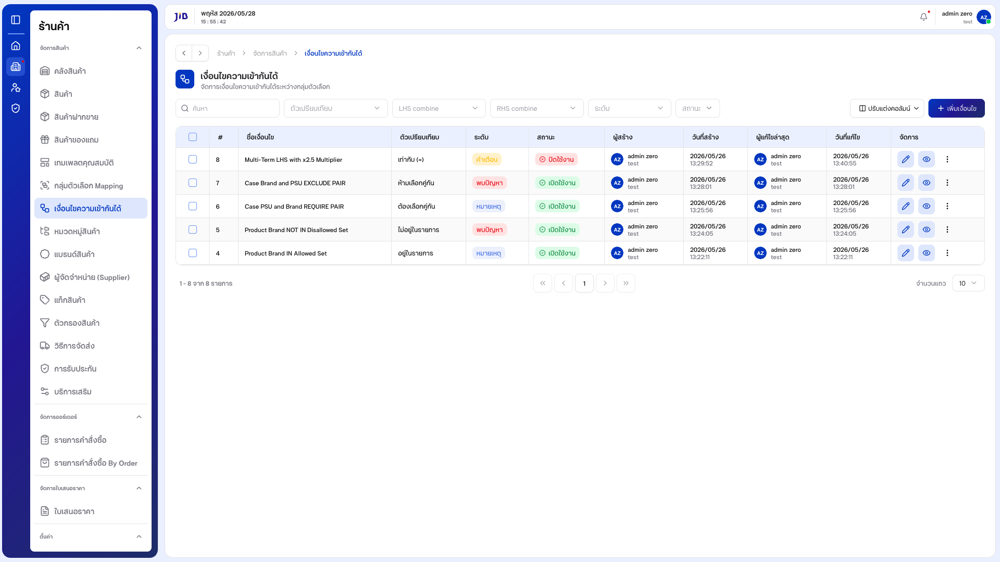
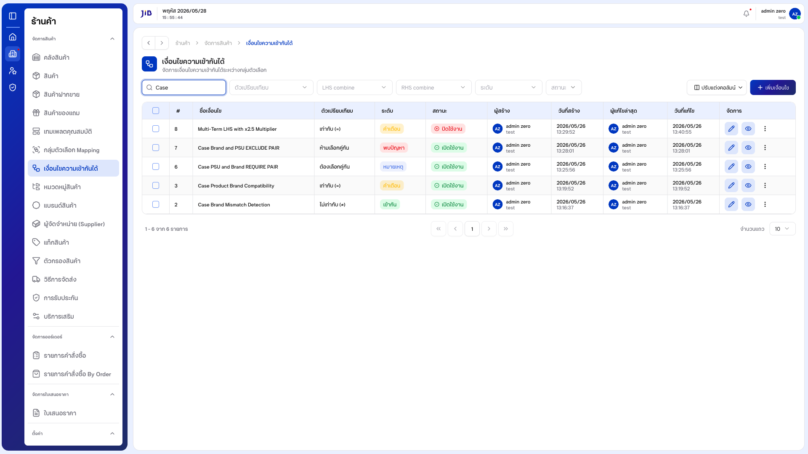
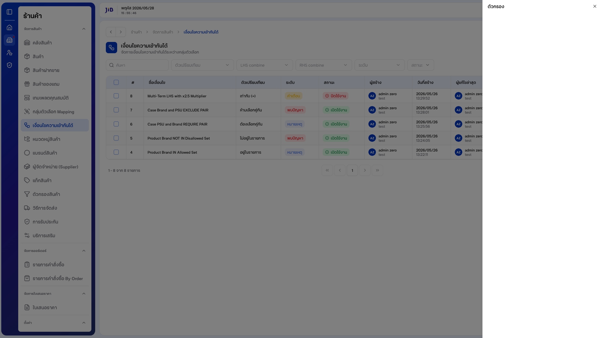
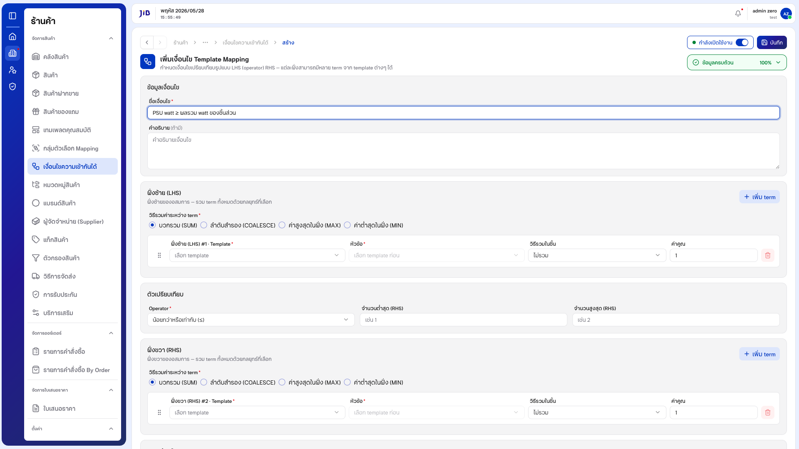
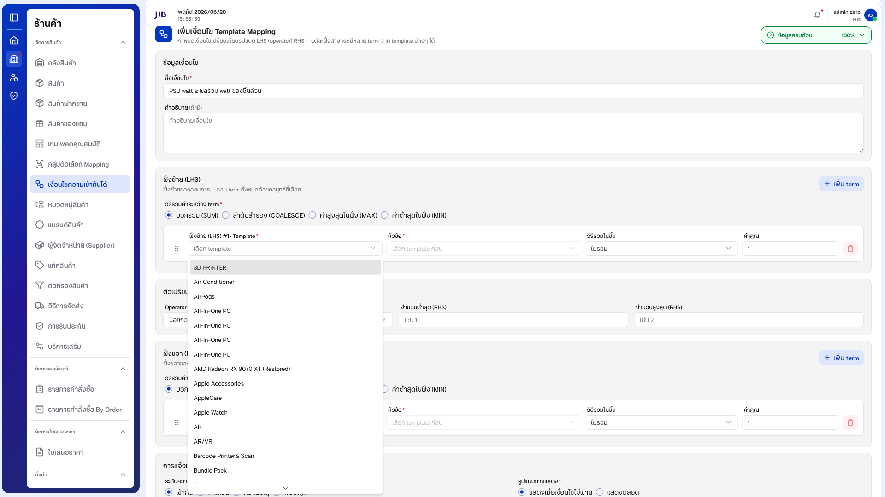
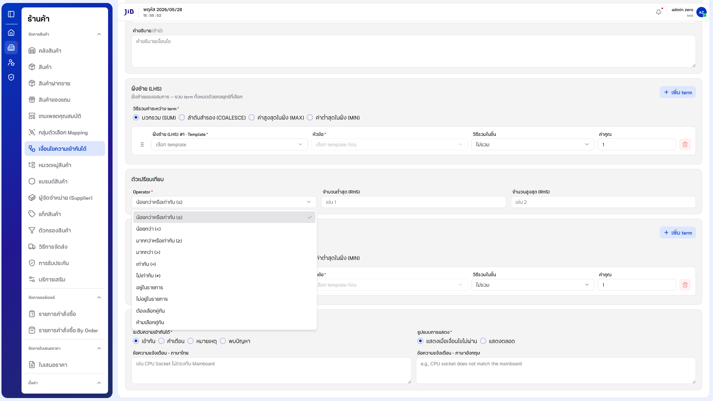
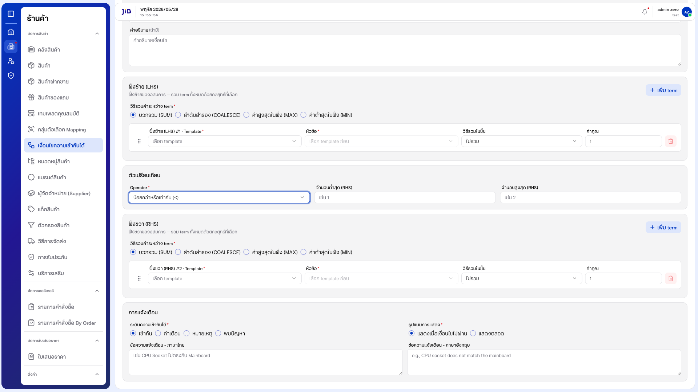

# คู่มือการใช้งาน: เงื่อนไขความเข้ากันได้

**เมนู:** ร้านค้า → จัดการสินค้า → เงื่อนไขความเข้ากันได้  
**URL:** https://devstorex.jibc.codelabdev.co/store/product-manager/template-mapping-conditions

เงื่อนไขความเข้ากันได้คือ **Rule Builder** สำหรับสร้างกฎเปรียบเทียบความเข้ากันได้ของสินค้าคอมพิวเตอร์ เพื่อป้องกันลูกค้าซื้อสเปคที่เข้ากันไม่ได้ เช่น *PSU watt ≥ ผลรวม watt ของชิ้นส่วน*, *CPU socket = Mainboard socket*, *RAM type อยู่ในรายการที่ Mainboard รองรับ*

แต่ละเงื่อนไขคืออสมการในรูปแบบ **ฝั่งซ้าย (LHS) — ตัวเปรียบเทียบ (operator) — ฝั่งขวา (RHS)** โดย LHS และ RHS อ้างอิงจาก **กลุ่มตัวเลือก Mapping** (Template + หัวข้อ)

> คู่มือนี้เริ่มที่ **หน้ารายการเงื่อนไข** โดยสมมติว่าผู้ใช้เข้าสู่ระบบและเปิดเมนูนี้แล้ว  
> **ข้อกำหนดเบื้องต้น:** ต้องมี **กลุ่มตัวเลือก Mapping** ที่มีหัวข้ออยู่แล้ว เพื่อนำมาใช้เป็น Template ในเงื่อนไข

---

## 1. หน้ารายการเงื่อนไข

### 1.1 โครงสร้างหน้าจอรายการ

**1.1.1** หน้ารายการแสดงหัวข้อ **「เงื่อนไขความเข้ากันได้」** พร้อมคำอธิบาย **「จัดการเงื่อนไขความเข้ากันได้ระหว่างกลุ่มตัวเลือก」**

**1.1.2** แถบเครื่องมือประกอบด้วย ช่อง **「ค้นหา」**, ตัวกรอง **「ตัวเปรียบเทียบ」**, **「LHS combine」**, **「RHS combine」**, **「ระดับ」**, **「สถานะ」**, ปุ่ม **「ตัวกรอง」**, **「ปรับแต่งคอลัมน์」** และ **「+ เพิ่มเงื่อนไข」**

**1.1.3** คอลัมน์หลักในตาราง ได้แก่ #, ชื่อเงื่อนไข, สมการ, ตัวเปรียบเทียบ, ระดับ, สถานะ, ผู้สร้าง, วันที่สร้าง, ผู้แก้ไขล่าสุด, วันที่แก้ไข, จัดการ

**หน้าจอรายการเงื่อนไข**



---

### 1.2 การค้นหา

**1.2.1** คลิกช่อง **「ค้นหา」** แล้วพิมพ์ชื่อเงื่อนไขที่ต้องการ

**1.2.2** ระบบกรองรายการให้อัตโนมัติตาม keyword

**หน้าจอการค้นหา**



---

### 1.3 การใช้ตัวกรอง

**1.3.1** คลิกปุ่ม **「ตัวกรอง」** — ระบบเปิดแผงตัวกรองด้านข้าง ซึ่งมีหลายส่วน เช่น **ตัวเปรียบเทียบ**, **LHS combine**, **RHS combine**, **ระดับ** และ **สถานะ**

**1.3.2** เลือกเงื่อนไขที่ต้องการ แล้วปิดแผง หรือกด **Esc** เพื่อปิดโดยไม่บันทึก

**หน้าจอแผงตัวกรอง**



> นอกจากนี้คอลัมน์ **「จัดการ」** ของแต่ละแถวยังมีไอคอน **ดู (eye)** สำหรับเปิดดูรายละเอียดเงื่อนไข และปุ่มเมนู **3 จุด** สำหรับ **「ปิดการใช้งาน」** / **「ลบ」**

---

## 2. การสร้างเงื่อนไข

จากหน้ารายการ คลิกปุ่ม **「+ เพิ่มเงื่อนไข」** — ระบบเปิดหน้า **「เพิ่มเงื่อนไข Template Mapping」** ซึ่งแบ่งเป็น 5 ส่วน มุมขวาบนมีแถบ **「กำลังดำเนินการ %」** แสดงความคืบหน้า

**หน้าจอสร้างเงื่อนไข — ภาพรวม**



---

### 2.1 ส่วนที่ 1: ข้อมูลเงื่อนไข

**2.1.1** กรอก **ชื่อเงื่อนไข** (บังคับ) เช่น "PSU watt ≥ ผลรวม watt ของชิ้นส่วน" — รองรับสัญลักษณ์คณิตศาสตร์ (≥, Σ) และภาษาไทย

**2.1.2** (ทางเลือก) กรอก **คำอธิบาย**

---

### 2.2 ส่วนที่ 2: ฝั่งซ้าย (LHS)

ฝั่งซ้ายของอสมการ — รวม term ทั้งหมดด้วยกลยุทธ์ที่เลือก

**2.2.1** เลือก **วิธีรวมค่าระหว่าง term** (ค่าเริ่มต้น **บวกรวม (SUM)**):

| ตัวเลือก | ความหมาย |
|----------|----------|
| **บวกรวม (SUM)** | นำค่าทุก term มาบวกกัน (ค่าเริ่มต้น) |
| **ลำดับสำรอง (COALESCE)** | ใช้ค่าแรกที่มีข้อมูล |
| **ค่าสูงสุดในฝั่ง (MAX)** | ใช้ค่าสูงสุด |
| **ค่าต่ำสุดในฝั่ง (MIN)** | ใช้ค่าต่ำสุด |

**2.2.2** ในแต่ละ **term** กำหนด:

- **Template** (บังคับ) — เลือกกลุ่มตัวเลือก Mapping
- **หัวข้อ** (บังคับ) — เลือกหัวข้อภายใน Template (ต้องเลือก Template ก่อน จึงจะเลือกหัวข้อได้)
- **วิธีรวมในชิ้น** — ไม่รวม / ผลรวม / คูณ / นับจำนวน / ค่าสูงสุด / ค่าต่ำสุด (ค่าเริ่มต้น **ไม่รวม**)
- **ค่าคูณ** — ตัวคูณค่าของ term (ค่าเริ่มต้น **1**, รองรับทศนิยม)

**2.2.3** คลิก **「+ เพิ่ม term」** เพื่อเพิ่ม term หลายตัวในฝั่งเดียวกัน หรือไอคอน **ถังขยะ** เพื่อลบ term

**หน้าจอเลือก Template (LHS)**



---

### 2.3 ส่วนที่ 3: ตัวเปรียบเทียบ (Operator)

**2.3.1** เลือก **Operator** (ค่าเริ่มต้น **น้อยกว่าหรือเท่ากับ (≤)**) — มีทั้งหมด 10 แบบ:

| กลุ่ม | ตัวเปรียบเทียบ |
|-------|----------------|
| เปรียบเทียบค่า | ≤ (น้อยกว่าหรือเท่ากับ), < (น้อยกว่า), ≥ (มากกว่าหรือเท่ากับ), > (มากกว่า), = (เท่ากับ), ≠ (ไม่เท่ากับ) |
| รายการ | อยู่ในรายการ, ไม่อยู่ในรายการ |
| คู่ความสัมพันธ์ | ต้องเลือกคู่กัน, ห้ามเลือกคู่กัน |

**2.3.2** (ทางเลือก) กรอก **จำนวนต่ำสุด (RHS)** และ **จำนวนสูงสุด (RHS)** เพื่อกำหนดช่วงค่า

**หน้าจอเลือก Operator**



---

### 2.4 ส่วนที่ 4: ฝั่งขวา (RHS)

**2.4.1** โครงสร้างเหมือนฝั่งซ้ายทุกประการ (วิธีรวมค่าระหว่าง term, Template, หัวข้อ, วิธีรวมในชิ้น, ค่าคูณ, เพิ่ม term)

**2.4.2** เลือก **Template** และ **หัวข้อ** ของ RHS (บังคับเช่นเดียวกับ LHS) — สามารถใช้ Template เดียวกับ LHS ได้

**หน้าจอฝั่งขวา (RHS)**



---

### 2.5 ส่วนที่ 5: การแจ้งเตือน

**2.5.1** เลือก **ระดับความเข้ากันได้** (ค่าเริ่มต้น **เข้ากัน**):

| ระดับ | ความหมาย |
|-------|----------|
| **เข้ากัน** | ผ่านเงื่อนไข (ค่าเริ่มต้น) |
| **คำเตือน** | แจ้งเตือนระดับเบา |
| **หมายเหตุ** | ข้อสังเกตเพิ่มเติม |
| **พบปัญหา** | เข้ากันไม่ได้ / บล็อก |

**2.5.2** เลือก **รูปแบบการแสดง** (ค่าเริ่มต้น **แสดงเมื่อเงื่อนไขไม่ผ่าน**):

| ตัวเลือก | ความหมาย |
|----------|----------|
| **แสดงเมื่อเงื่อนไขไม่ผ่าน** | แสดงข้อความเฉพาะเมื่อเงื่อนไขไม่ผ่าน (ON_TRIGGER) |
| **แสดงตลอด** | แสดงข้อความเสมอ (ALWAYS) |

**2.5.3** กรอก **ข้อความแจ้งเตือน - ภาษาไทย** และ **ภาษาอังกฤษ** (กรอกแยกอิสระ ไม่มีการ sync ระหว่างภาษา)

**2.5.4** สวิตช์ **「กำลังเปิดใช้งาน」** (มุมขวาบน) ค่าเริ่มต้นเปิดอยู่

**หน้าจอส่วนการแจ้งเตือน**


---

### 2.6 บันทึกเงื่อนไข

**2.6.1** ตรวจสอบทุกส่วนให้ครบ — ฟิลด์บังคับได้แก่ **ชื่อเงื่อนไข**, **LHS Template + หัวข้อ**, **RHS Template + หัวข้อ**

**2.6.2** คลิกปุ่ม **「บันทึก」** (มุมขวาบน)

**2.6.3** เมื่อสำเร็จ ระบบแจ้ง **「บันทึกสำเร็จ」** และนำกลับ **หน้ารายการ** — แถวใหม่จะแสดงพร้อม **สมการ**, **ตัวเปรียบเทียบ** และ **ระดับ** ที่กำหนด

> หากกดบันทึกโดยฟิลด์บังคับไม่ครบ ระบบจะแสดงข้อความ เช่น **「กรุณากรอกชื่อเงื่อนไข」**, **「กรุณาเลือก template」**, **「กรุณาเลือกหัวข้อ」** ใต้แต่ละฟิลด์ และยังอยู่ที่หน้าสร้าง

---

## 3. การแก้ไขและจัดการเงื่อนไข

**3.1** คลิกไอคอน **ดินสอ (แก้ไข)** ในคอลัมน์ **「จัดการ」** — ระบบเปิดหน้าแก้ไข (URL `/template-mapping-conditions/update/{id}`) พร้อมข้อมูลเดิมครบทุกส่วน แก้ไขแล้ว **「บันทึก」**

**3.2** คลิกไอคอน **ดู (eye)** เพื่อเปิด dialog แสดงรายละเอียดเงื่อนไข (ชื่อ, คำอธิบาย, สมการ, ตัวเปรียบเทียบ)

**3.3** คลิกปุ่มเมนู **3 จุด** — มีตัวเลือก **「ปิดการใช้งาน」** (มี dialog ยืนยัน) และ **「ลบ」**

**3.4** ใช้ checkbox หัวตารางเพื่อเลือกหลายแถว แล้วใช้การดำเนินการแบบกลุ่ม (**สถานะสินค้า**, **ลบ**)

---

## 4. เงื่อนไขและข้อควรระวัง

| ฟิลด์ / กรณี | รายละเอียด |
|--------------|------------|
| ชื่อเงื่อนไข | บังคับ — รองรับสัญลักษณ์คณิต (≥, Σ) และภาษาไทย |
| LHS Template / หัวข้อ | บังคับ — ต้องเลือก Template ก่อนจึงเลือกหัวข้อได้ |
| RHS Template / หัวข้อ | บังคับ — ใช้ Template เดียวกับ LHS ได้ |
| Operator | ค่าเริ่มต้น ≤ — มีทั้งหมด 10 แบบ |
| วิธีรวมค่าระหว่าง term | ค่าเริ่มต้น SUM (มี SUM / COALESCE / MAX / MIN) |
| วิธีรวมในชิ้น | ค่าเริ่มต้น ไม่รวม (6 ตัวเลือก) |
| ค่าคูณ | ค่าเริ่มต้น 1 — รองรับทศนิยม |
| ระดับความเข้ากันได้ | ค่าเริ่มต้น เข้ากัน (4 ระดับ) |
| ข้อความแจ้งเตือน TH/EN | กรอกแยกอิสระ ไม่มี sync ระหว่างภาษา |
| ข้อกำหนดเบื้องต้น | ต้องมี **กลุ่มตัวเลือก Mapping** ที่มีหัวข้อ ก่อนสร้างเงื่อนไข |
| ออกจากหน้าโดยยังไม่บันทึก | ระบบแสดงคำเตือน (beforeunload) เมื่อมีการแก้ไขค้างอยู่ |

---

### อัปเดตภาพหน้าจอและ PDF

```bash
npm run manual:mapping-conditions
```

ภาพ: `docs/images/mapping-conditions/` · PDF: `docs/เงื่อนไขความเข้ากันได้-คู่มือผู้ใช้.pdf`
