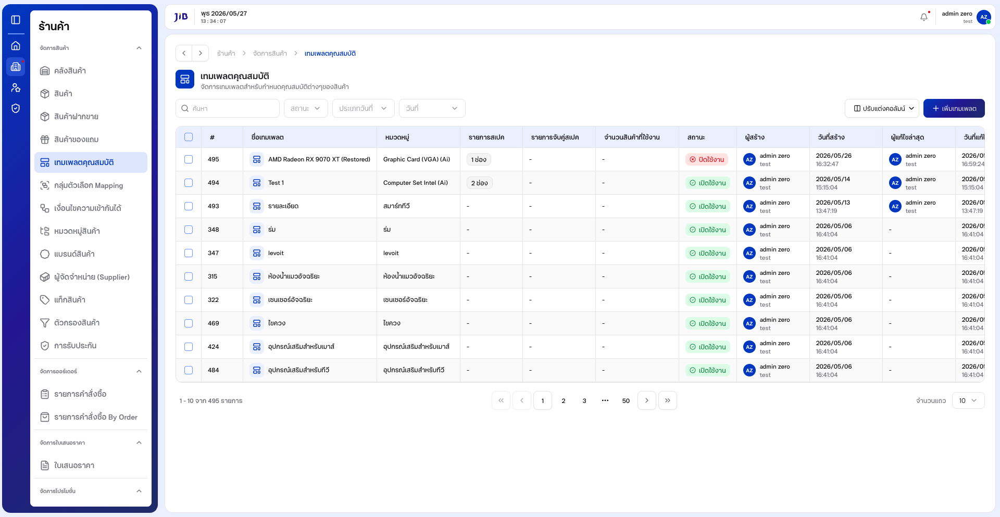
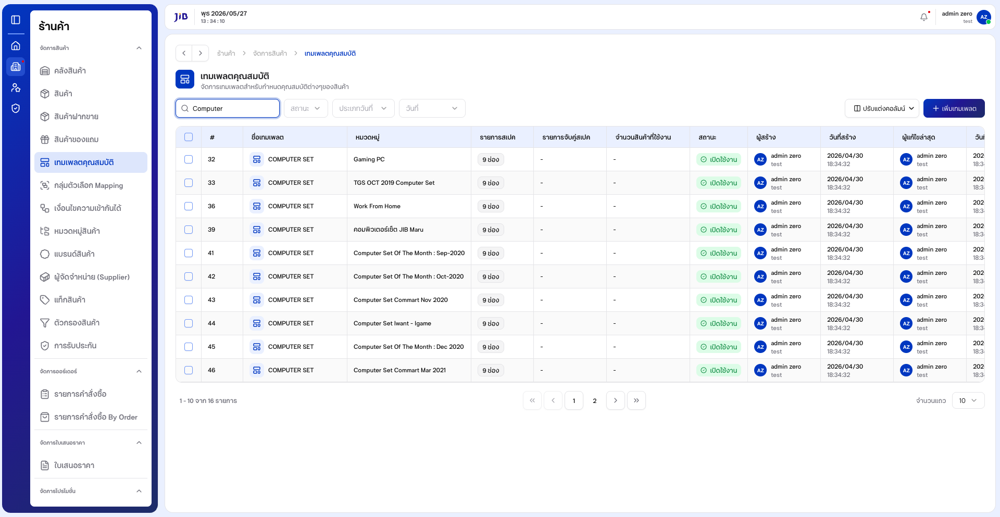
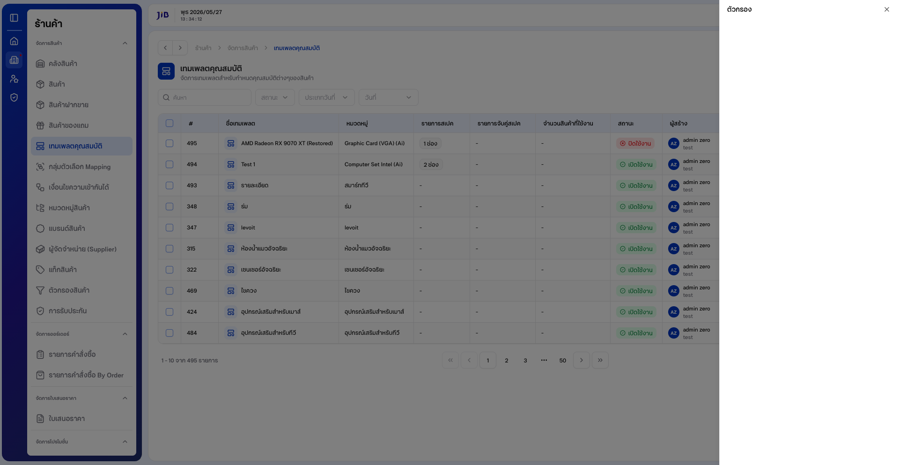
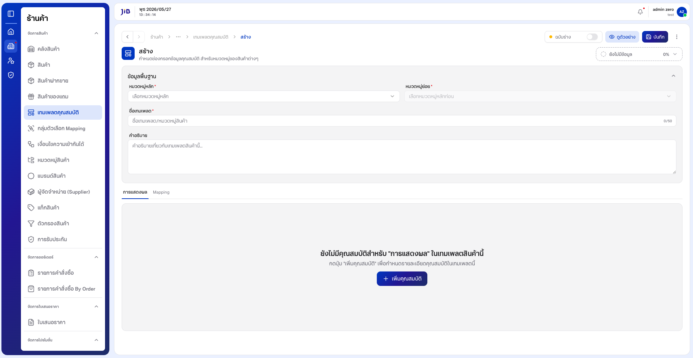
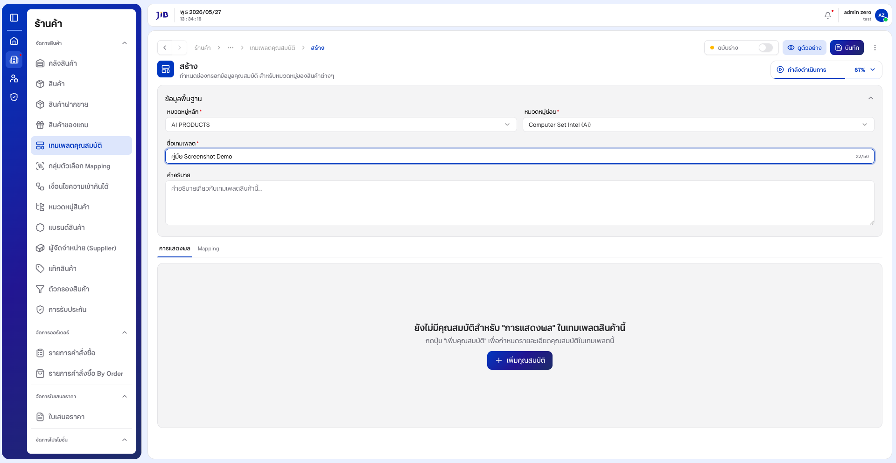
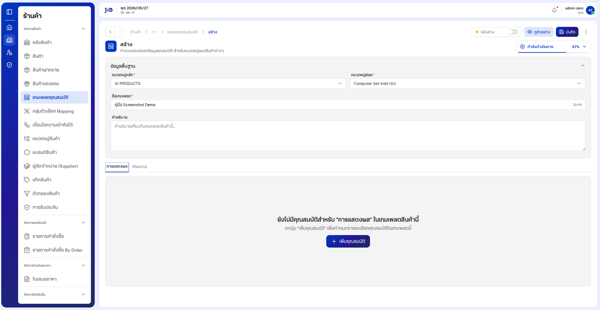
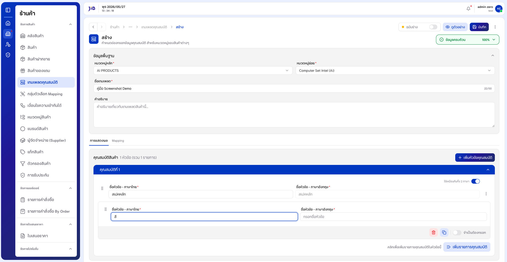
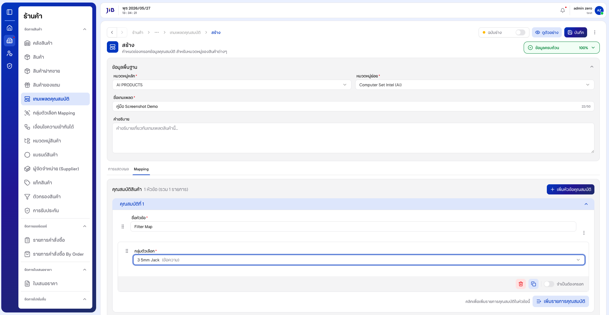
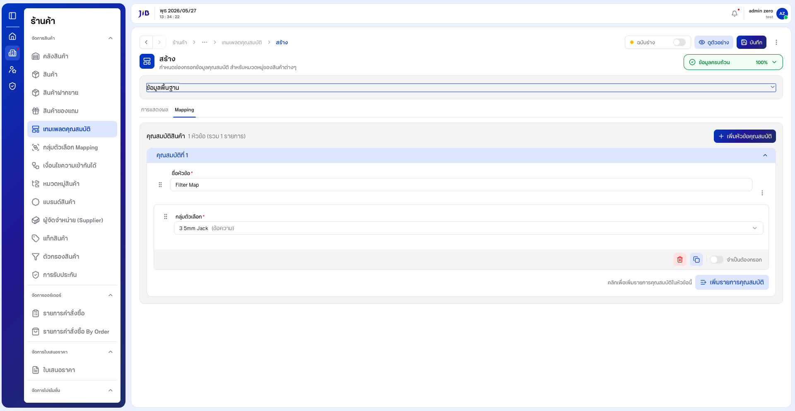
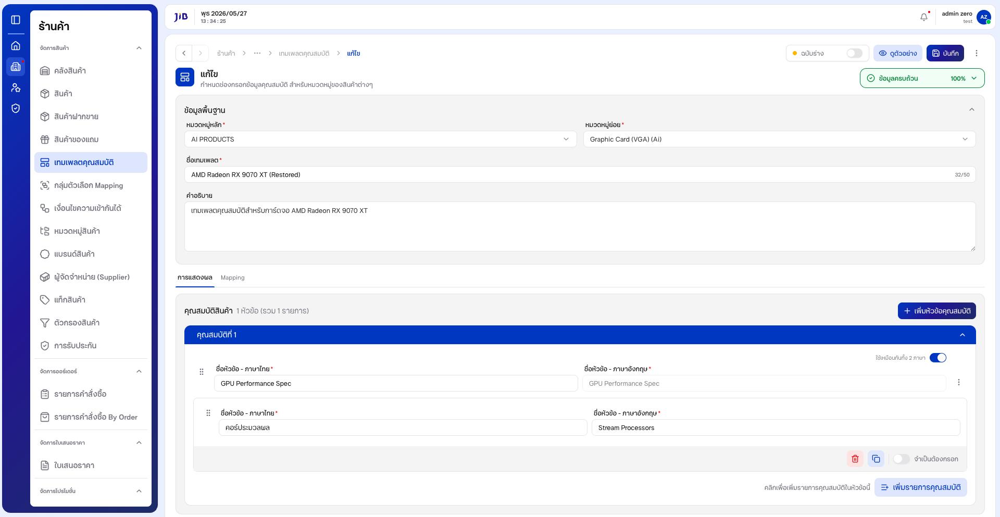

# คู่มือการใช้งาน: เทมเพลตคุณสมบัติ

**เมนู:** ร้านค้า → จัดการสินค้า → เทมเพลตคุณสมบัติ  
**URL:** https://devstorex.jibc.codelabdev.co/store/product-manager/template-attributes

เทมเพลตคุณสมบัติใช้กำหนดโครงสร้างสเปกสินค้าแบบมาตรฐาน (**เทมเพลต → หัวข้อ → รายการ**) รองรับ **การแสดงผล** (สเปกบนหน้าร้าน) และ **Mapping** (ผูกกลุ่มตัวเลือก)

> คู่มือนี้เริ่มที่ **หน้ารายการเทมเพลตคุณสมบัติ** โดยสมมติว่าผู้ใช้เข้าสู่ระบบและเปิดเมนูนี้แล้ว

---

## 1. หน้ารายการเทมเพลตคุณสมบัติ

### 1.1 โครงสร้างหน้าจอรายการ

**1.1.1** หน้ารายการแสดงตารางเทมเพลต พร้อมช่อง **「ค้นหา」**, ปุ่ม **「ตัวกรอง」**, **「ปรับแต่งคอลัมน์」** และ **「เพิ่มเทมเพลต」**

**หน้าจอรายการเทมเพลตคุณสมบัติ**



---

### 1.2 การค้นหาเทมเพลต

**1.2.1** คลิกช่อง **「ค้นหา」** แล้วพิมพ์ชื่อเทมเพลต (ภาษาไทยหรืออังกฤษ)

**1.2.2** รอสักครู่ ระบบจะกรองรายการในตารางให้ตรงกับคำค้น

**หน้าจอการค้นหาเทมเพลต**



**หมายเหตุ:** การค้นหาด้วยเลขรหัสในคอลัมน์ **#** อาจยังไม่แสดงผล — แนะนำค้นหาด้วยชื่อเทมเพลต

---

### 1.3 การใช้ตัวกรองข้อมูล

**1.3.1** คลิกปุ่ม **「ตัวกรอง」**

**1.3.2** เลือกเงื่อนไขในส่วน **「สถานะ」** และ/หรือช่วง **วันที่** ตามต้องการ

**1.3.3** คลิก **「ตกลง」** เพื่อใช้ตัวกรอง หรือกด **Esc** เพื่อปิดแผงโดยไม่บันทึก

**หน้าจอแผงตัวกรองข้อมูล**



---

## 2. การสร้างเทมเพลตคุณสมบัติ

### 2.1 การเปิดหน้าสร้างและกรอกข้อมูลพื้นฐาน

**2.1.1** จากหน้ารายการ คลิกปุ่ม **「เพิ่มเทมเพลต」**

**2.1.2** ระบบเปิดหน้าสร้าง แท็บเริ่มต้นคือ **「ข้อมูลพื้นฐาน」**

**หน้าจอสร้างเทมเพลต — ข้อมูลพื้นฐาน**



---

**2.1.3** เลือก **「หมวดหมู่หลัก」** จากรายการแบบเลื่อนลง

**2.1.4** เลือก **「หมวดหมู่ย่อย」** (จะเปิดให้เลือกได้หลังเลือกหมวดหมู่หลักแล้ว)

**2.1.5** กรอก **「ชื่อเทมเพลต」** (สูงสุด 50 ตัวอักษร — ดูตัวนับ **X/50**)

**2.1.6** (ไม่บังคับ) กรอก **「คำอธิบาย」** และตั้ง **「ฉบับร่าง」** หากต้องการบันทึกเป็นร่าง

**หน้าจอกรอกหมวดหมู่และชื่อเทมเพลต**



---

### 2.2 การกำหนดคุณสมบัติแบบการแสดงผล

**2.2.1** คลิกแท็บ **「การแสดงผล」**

**หน้าจอแท็บการแสดงผล (ยังไม่มีหัวข้อ)**



---

**2.2.2** คลิก **「เพิ่มคุณสมบัติ」** แล้วกรอก **ชื่อหัวข้อ - ภาษาไทย** (หากเปิด **「ใช้เหมือนกันทั้ง 2 ภาษา」** ชื่ออังกฤษจะถูกเติมอัตโนมัติ)

**2.2.3** คลิก **「เพิ่มรายการคุณสมบัติ」** แล้วกรอกชื่อรายการ (เช่น สี, ขนาด)

**2.2.4** (ไม่บังคับ) เปิดสวิตช์ **「จำเป็นต้องกรอก」** หากต้องการบังคับกรอกตอนเพิ่มสินค้า

**หน้าจอหัวข้อและรายการคุณสมบัติ**



---

### 2.3 การกำหนดคุณสมบัติแบบ Mapping

**หมายเหตุ:** ควรสร้าง **กลุ่มตัวเลือก Mapping** ให้พร้อมก่อน

**2.3.1** คลิกแท็บ **「Mapping」**

**หน้าจอแท็บ Mapping**


---

**2.3.2** คลิก **「เพิ่มคุณสมบัติ」** → กรอกชื่อหัวข้อ → **「เพิ่มรายการคุณสมบัติ」** → เลือก **「เลือกกลุ่มตัวเลือก」**

**หน้าจอ Mapping พร้อมกลุ่มตัวเลือก**



---

### 2.4 การบันทึกเทมเพลต

**2.4.1** คลิกปุ่ม **「บันทึก」** ที่ส่วนหัวของฟอร์ม

**2.4.2** เมื่อบันทึกสำเร็จ ระบบแจ้งข้อความสำเร็จและนำกลับหน้ารายการ

**หน้าจอปุ่มบันทึกบนฟอร์มสร้าง**



---

## 3. การแก้ไขเทมเพลตคุณสมบัติ

**3.1** จากหน้ารายการ คลิกไอคอน **「ดินสอ」** (แก้ไข) ในแถวที่ต้องการ

**3.2** ระบบแสดงข้อมูลเดิมในทุกแท็บ — แก้ไขตามต้องการแล้วคลิก **「บันทึก」**

**หน้าจอแก้ไขเทมเพลต**



---

## 4. การคัดลอก ปิดการใช้งาน และลบ

**4.1** เปิดหน้าแก้ไข → เมนู **「⋮」** → **「คัดลอก」** / **「ปิดการใช้งาน」** / **「ลบ」** ตามต้องการ

**4.2** จากหน้ารายการ สามารถเลือกหลายแถวด้วย Checkbox แล้วใช้ปุ่ม **「คัดลอก」** หรือ **「ลบ」** แบบกลุ่ม

**คำเตือน:** ตรวจสอบคอลัมน์ **「จำนวนสินค้าที่ใช้งาน」** ก่อนลบ — หากมีสินค้าใช้งานอยู่ การลบอาจกระทบข้อมูล

---

## 5. เงื่อนไขและข้อควรระวัง

| ฟิลด์ / กรณี | รายละเอียด |
|--------------|------------|
| หมวดหมู่หลัก / ย่อย | บังคับ — แจ้ง **กรุณาเลือกหมวดหมู่** |
| ชื่อเทมเพลต | บังคับ, สูงสุด 50 ตัวอักษร |
| คำอธิบาย | ไม่บังคับ |
| หัวข้อ + รายการ | มีหัวข้อแล้วต้องมีรายการภายใน — มิฉะนั้นบันทึกไม่ผ่าน |
| เรียงคอลัมน์ในตาราง | อาจยังไม่ทำงาน |
| ค้นหาด้วยเลข # | อาจไม่พบผล |

**ลำดับแนะนำ:** กลุ่มตัวเลือก Mapping → เทมเพลตคุณสมบัติ → เงื่อนไขความเข้ากันได้ (ถ้ามี) → ผูกกับสินค้า

---

### อัปเดตภาพหน้าจอ

```bash
npm run manual:template   # จับภาพ + สร้าง PDF
```

ภาพ: `docs/images/template-attributes/` · PDF: `docs/เทมเพลตคุณสมบัติ-คู่มือผู้ใช้.pdf`
