# คู่มือการใช้งาน: โปรโมชั่น

**เมนู:** ร้านค้า → จัดการโปรโมชั่น → โปรโมชั่น  
**URL:** https://devstorex.jibc.codelabdev.co/store/promotion-manager/promotions

โปรโมชั่นใช้สร้างและจัดการ **แคมเปญส่งเสริมการขาย** โดยแต่ละแคมเปญประกอบด้วยข้อมูลทั่วไป และ **รายการโปรโมชั่น** (รายการย่อยภายในแคมเปญ) รองรับรูปแบบแคมเปญหลายประเภท เช่น ส่วนลด, Bundle, Flash sale และ Add on

> คู่มือนี้เริ่มที่ **หน้ารายการโปรโมชั่น** โดยสมมติว่าผู้ใช้เข้าสู่ระบบและเปิดเมนูนี้แล้ว

---

## 1. หน้ารายการโปรโมชั่น

### 1.1 โครงสร้างหน้าจอรายการ

**1.1.1** หน้ารายการแสดงตารางโปรโมชั่นทั้งหมด พร้อมช่อง **「ค้นหาชื่อโปรโมชัน」**, ปุ่ม **「ตัวกรอง」**, **「ปรับแต่งคอลัมน์」** และ **「เพิ่มโปรโมชัน」**

**หน้าจอรายการโปรโมชั่น**

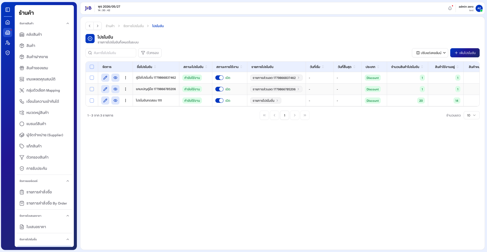

---

### 1.2 การค้นหาโปรโมชั่น

**1.2.1** คลิกช่อง **「ค้นหาชื่อโปรโมชัน」** แล้วพิมพ์ชื่อที่ต้องการ

**1.2.2** รอสักครู่ ระบบจะกรองรายการในตาราง

**หน้าจอการค้นหาโปรโมชั่น**

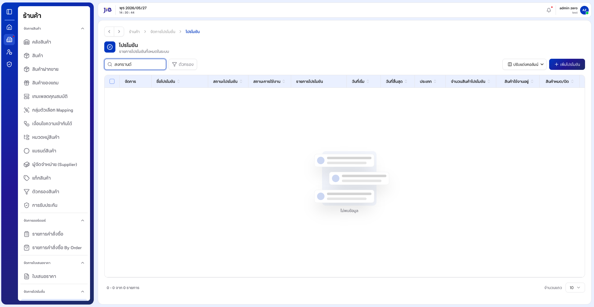

---

### 1.3 การใช้ตัวกรองข้อมูล

**1.3.1** คลิกปุ่ม **「ตัวกรอง」**

**1.3.2** ตั้งเงื่อนไขตามที่ต้องการในหน้าต่างตัวกรอง

**1.3.3** คลิก **「ตกลง」** เพื่อใช้ตัวกรอง หรือกด **Esc** / **「ยกเลิก」** เพื่อปิดโดยไม่บันทึก

**หน้าจอแผงตัวกรองข้อมูล**

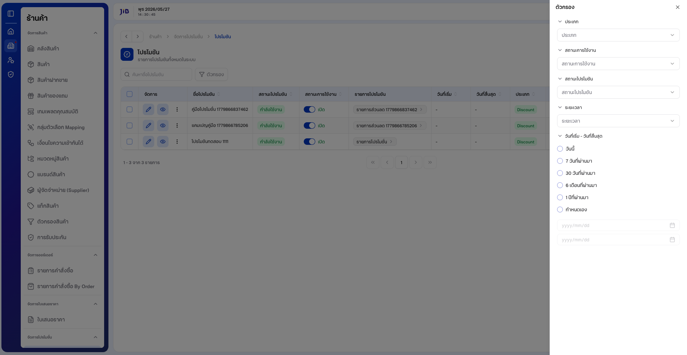

---

## 2. การสร้างแคมเปญโปรโมชั่น

### 2.1 เลือกรูปแบบแคมเปญ

**2.1.1** จากหน้ารายการ คลิกปุ่ม **「เพิ่มโปรโมชัน」**

**2.1.2** ระบบแสดงหน้าต่าง **「เลือกรูปแบบแคมเปญสินค้า」** พร้อมตัวเลือก:

| รูปแบบ | คำอธิบายโดยย่อ |
|--------|----------------|
| **Discount/ส่วนลด** | แคมเปญลดราคา / ส่วนลด |
| **Bundle** | ชุดสินค้า / ซื้อคู่ |
| **Flash sale** | โปรโมชั่นช่วงเวลาจำกัด |
| **Add on** | สินค้าเสริม / แถม |

**หน้าจอเลือกรูปแบบแคมเปญ**

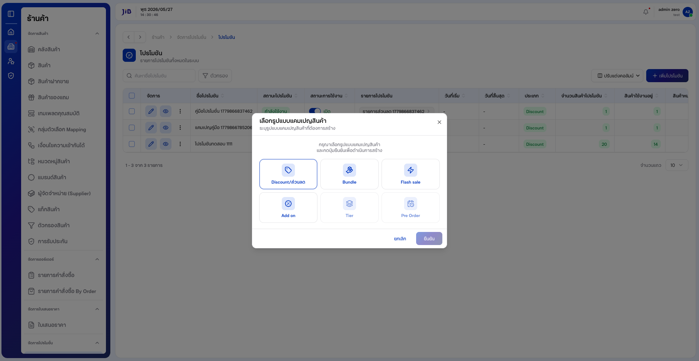

---

**2.1.3** คลิกเลือกรูปแบบที่ต้องการ (เช่น **「Discount/ส่วนลด」**) — ปุ่ม **「ยืนยัน」** จะเปิดใช้งานเมื่อเลือกแล้ว

**หน้าจอหลังเลือกรูปแบบแคมเปญ**

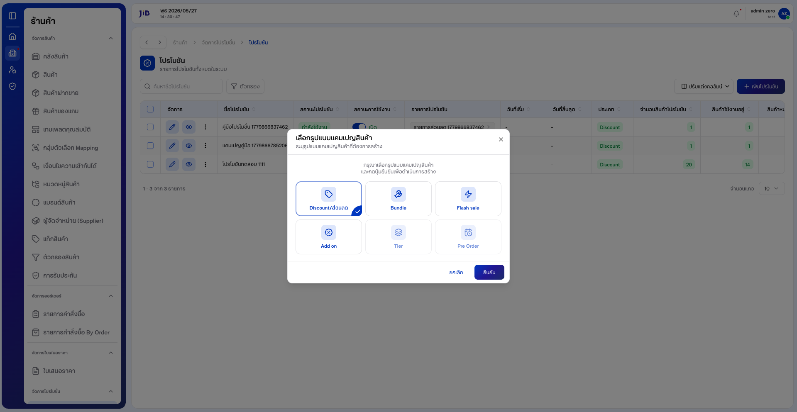

---

**2.1.4** คลิก **「ยืนยัน」** เพื่อไปหน้าสร้างแคมเปญ  
หากต้องการยกเลิก คลิก **「ยกเลิก」** — ระบบปิดหน้าต่างและยังอยู่หน้ารายการ

---

### 2.2 กรอกข้อมูลทั่วไป

**2.2.1** หน้าสร้างแสดงหัวข้อ **「เพิ่มแคมเปญโปรโมชั่น」** แบ่งเป็น **「ข้อมูลทั่วไป」** และ **「รายการโปรโมชั่น」**

**หน้าจอสร้างแคมเปญ — ภาพรวม**

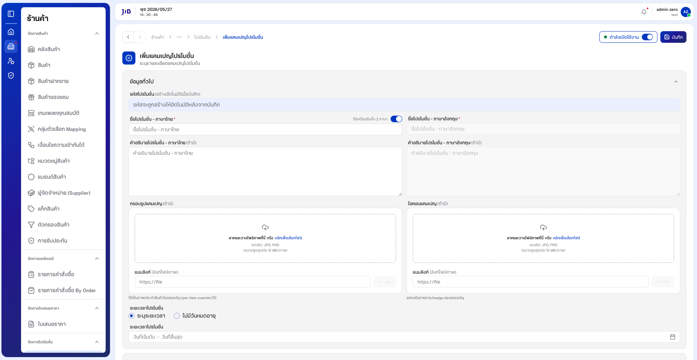

---

**2.2.2** กรอก **ชื่อโปรโมชัน - ภาษาไทย** (และคำอธิบาย หากต้องการ)

**2.2.3** ค่าเริ่มต้น **「ใช้เหมือนกันทั้ง 2 ภาษา」** เปิดอยู่ — ชื่อและคำอธิบายภาษาอังกฤษจะถูกเติมตามภาษาไทยอัตโนมัติ  
หากต้องการกรอกแยก ให้ปิดสวิตช์ **「ใช้เหมือนกันทั้ง 2 ภาษา」** แล้วกรอกฟิลด์ภาษาอังกฤษ

**2.2.4** ช่อง **「รหัสโปรโมชั่น」** แสดงข้อความ **「สร้างอัตโนมัติเมื่อบันทึก」** — ไม่ต้องกรอกเอง

**หน้าจอกรอกข้อมูลทั่วไป**

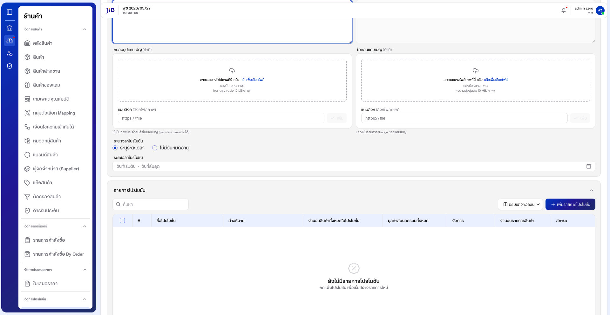

---

**2.2.5** ตั้ง **ระยะเวลาโปรโมชั่น**:

- **「ระบุระยะเวลา」** (ค่าเริ่มต้น) — คลิก **「วันที่เริ่มต้น」** / **「วันที่สิ้นสุด」** เพื่อเลือกช่วงเวลา  
- **「ไม่มีวันหมดอายุ」** — โปรโมชั่นไม่มีวันสิ้นสุด

**หน้าจอตั้งระยะเวลาโปรโมชั่น**

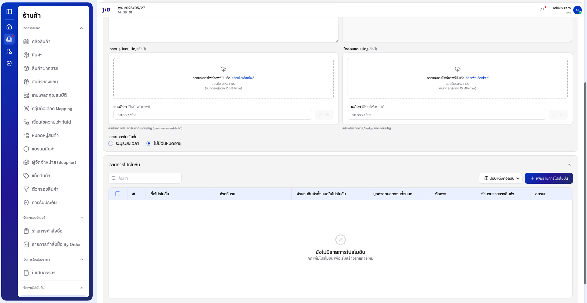

---

**2.2.6** ตรวจสอบ **สถานะ** (ค่าเริ่มต้นมักเป็น **「กำลังเปิดใช้งาน」**) — สลับสวิตช์หากต้องการปิดใช้งานชั่วคราว

---

### 2.3 เพิ่มรายการโปรโมชั่น (Wizard 3 ขั้นตอน)

แคมเปญประเภท **Discount/ส่วนลด** ต้องมี **อย่างน้อย 1 รายการโปรโมชั่น** และแต่ละรายการต้องมี **สินค้าที่เข้าร่วม** พร้อม **ราคา/ส่วนลดที่มูลค่ามากกว่า 0** ก่อนบันทึกแคมเปญได้

---

#### 2.3.1 เริ่มเพิ่มรายการจากหน้าแคมเปญ

**2.3.1.1** ในส่วน **「รายการโปรโมชั่น」** หากยังไม่มีรายการ ระบบแสดง **「ยังไม่มีรายการโปรโมชัน」**

**หน้าจอรายการโปรโมชั่นว่าง**

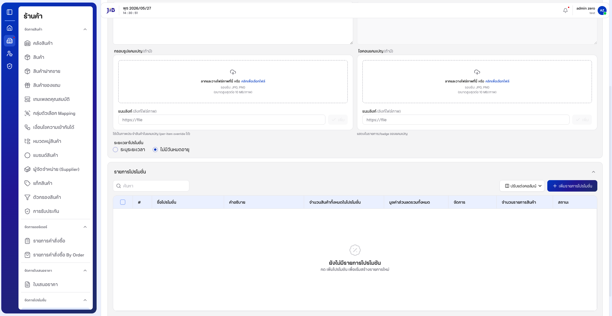

---

**2.3.1.2** คลิกปุ่ม **「+ เพิ่มรายการโปรโมชั่น」** (มุมขวาของส่วนรายการ)

**2.3.1.3** ระบบเปิดหน้า **「เพิ่มรายการโปรโมชัน」** พร้อมตัวบอกขั้นตอน **1 / 3** ที่มุมขวาบน

---

#### 2.3.2 ขั้นตอนที่ 1 — กรอกข้อมูลโปรโมชัน

**2.3.2.1** กรอก **ชื่อรายการโปรโมชั่น - ภาษาไทย** (บังคับ)

**2.3.2.2** ค่าเริ่มต้น **「ใช้เหมือนกันทั้ง 2 ภาษา」** เปิดอยู่ — ชื่อภาษาอังกฤษจะถูกเติมตามภาษาไทยอัตโนมัติ  
หากต้องการกรอกแยก ให้ปิดสวิตช์แล้วกรอกฟิลด์ภาษาอังกฤษ

**2.3.2.3** (ไม่บังคับ) กรอก **คำอธิบายโปรโมชั่น** ภาษาไทย / อังกฤษ

**2.3.2.4** เลือก **「รูปแบบการจัดส่ง」**:

| ตัวเลือก | ความหมาย |
|----------|----------|
| **ตามระบบ** | ใช้กฎการจัดส่งตามระบบ (ค่าเริ่มต้น) |
| **จัดส่งเอง** | จัดส่งแบบกำหนดเอง (เช่น next day ตามที่ระบบกำหนด) |

**หน้าจอ Wizard — ขั้นตอนที่ 1 (เริ่มต้น)**

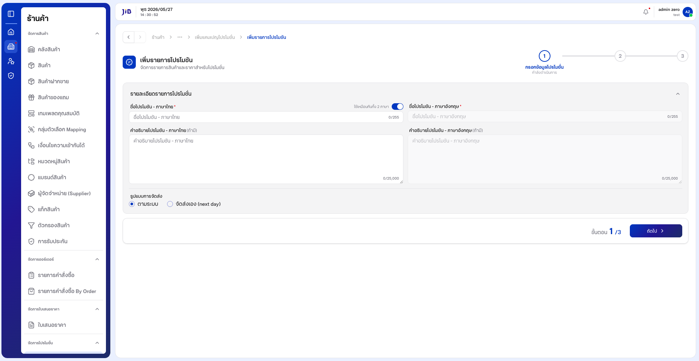

---

**2.3.2.5** หลังกรอกข้อมูลแล้ว ตรวจสอบความถูกต้องก่อนไปต่อ

**หน้าจอ Wizard — ขั้นตอนที่ 1 (กรอกข้อมูลแล้ว)**

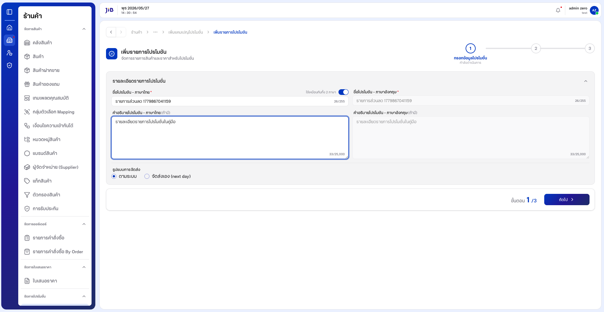

---

**2.3.2.6** คลิก **「ถัดไป」**  
หากไม่กรอกชื่อรายการ ระบบจะไม่ให้ไปขั้นตอนถัดไป

---

#### 2.3.3 ขั้นตอนที่ 2 — เลือกสินค้าและเงื่อนไข

**2.3.3.1** หน้าจอแสดงหัวข้อ **「รายการสินค้า」** พร้อมช่อง **「ค้นหา」** และตัวกรอง **หมวดหมู่ / แบรนด์ / สถานะ**

**หน้าจอ Wizard — ขั้นตอนที่ 2 (ยังไม่เลือกสินค้า)**

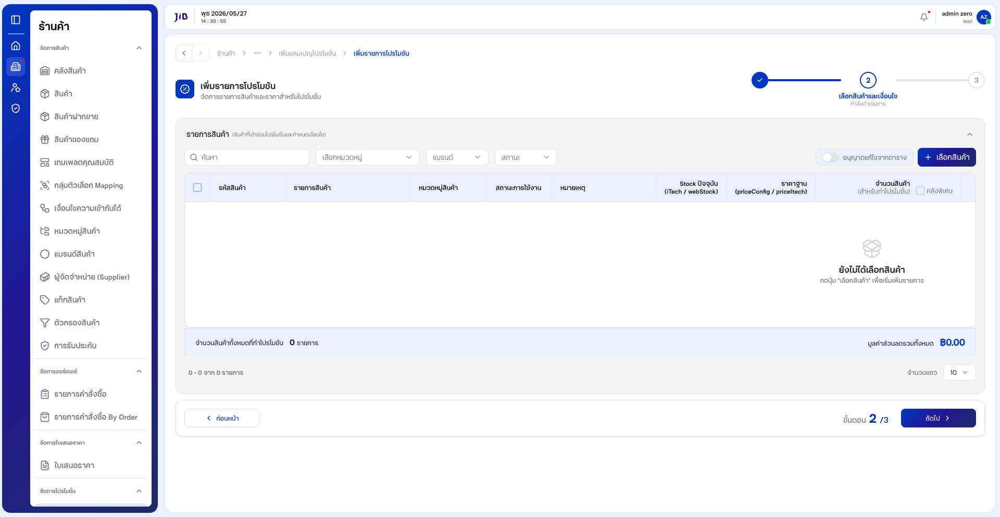

---

**2.3.3.2** หากกด **「ถัดไป」** โดยยังไม่เลือกสินค้า ระบบแจ้ง **「กรุณาเลือกสินค้าอย่างน้อย 1 รายการ」**

**หน้าจอแจ้งเตือนเมื่อยังไม่เลือกสินค้า**

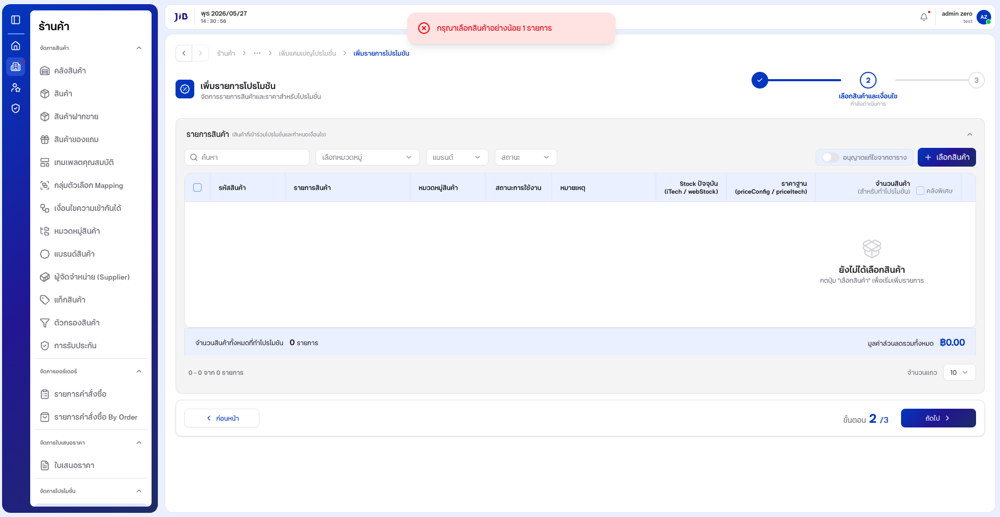

---

**2.3.3.3** คลิกปุ่ม **「+ เลือกสินค้า」** — ระบบเปิดหน้าต่าง **「เลือกสินค้าเข้าร่วมโปรโมชั่น」**

**2.3.3.4** ในหน้าต่างเลือกสินค้า:

1. ใช้ **「ค้นหา」** หรือตัวกรอง (ประเภท / หมวดหมู่ / แบรนด์ / สถานะ) เพื่อหาสินค้า  
2. ติ๊ก **ช่องเลือก** ที่แถวสินค้าที่ต้องการ (เลือกได้หลายรายการ)  
3. ตรวจสอบจำนวนที่เลือกที่ปุ่ม **「ยืนยัน (n)」**  
4. คลิก **「ยืนยัน」** — หรือ **「ยกเลิก」** หากไม่ต้องการเลือก

**หน้าจอเลือกสินค้าเข้าร่วมโปรโมชั่น**

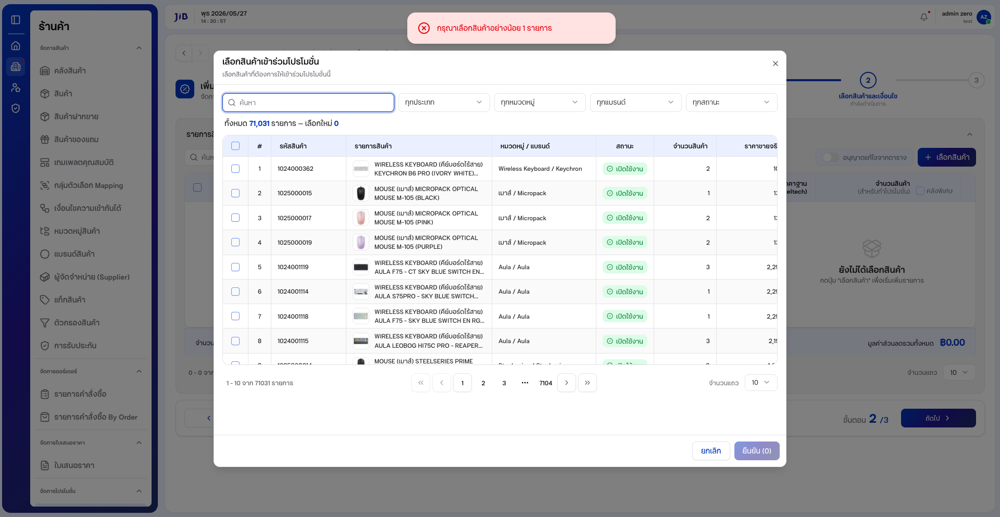

---

**2.3.3.5** หลังยืนยัน สินค้าจะแสดงในตาราง **「รายการสินค้า」** พร้อมคอลัมน์ เช่น รหัสสินค้า, รายการสินค้า, หมวดหมู่, สถานะ, Stock, ราคาฐาน

**หน้าจอหลังเลือกสินค้าแล้ว**

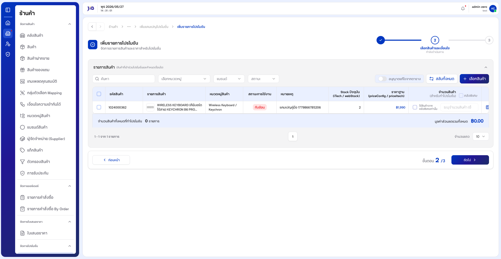

---

**2.3.3.6** กำหนดราคา/ส่วนลดในตาราง:

1. เปิดสวิตช์ **「อนุญาตแก้ไขจากตาราง」** (มุมขวาของตาราง)  
2. เลื่อนตารางไปทางขวาหากมองไม่เห็นคอลัมน์ราคาโปรโมชัน  
3. กรอก **ราคาโปรโมชัน** หรือค่าส่วนลดต่อรายการ (ต้องทำให้ **มูลค่าส่วนลดรวม** มากกว่า 0)  
4. (ถ้ามี) กำหนด **จำนวนสินค้า** หรือเลือก **คลังพิเศษ** ตามเงื่อนไขที่ต้องการ

**หน้าจอกำหนดราคาโปรโมชันในตาราง**


---

**2.3.3.7** คลิก **「ถัดไป」** เพื่อไปขั้นตอนที่ 3  
หากต้องการแก้ข้อมูลขั้นตอน 1 ให้คลิก **「ก่อนหน้า」**

---

#### 2.3.4 ขั้นตอนที่ 3 — ตรวจสอบรายการ

**2.3.4.1** ระบบแสดง **「สรุปรายละเอียดรายการโปรโมชัน」** ได้แก่ ชื่อ (ไทย/อังกฤษ), คำอธิบาย, รูปแบบการจัดส่ง

**2.3.4.2** ส่วน **「สรุปสินค้าที่เข้าร่วมโปรโมชัน」** แสดงตารางสรุป เช่น รหัสสินค้า, รายการสินค้า, ราคาปกติ, ลิมิตการซื้อ, **ส่วนลด/ต่อหน่วย**, **ราคาโปรโมชัน**

**2.3.4.3** ตรวจสอบความถูกต้องของทุกรายการก่อนบันทึก

**หน้าจอ Wizard — ขั้นตอนที่ 3 (ตรวจสอบ)**

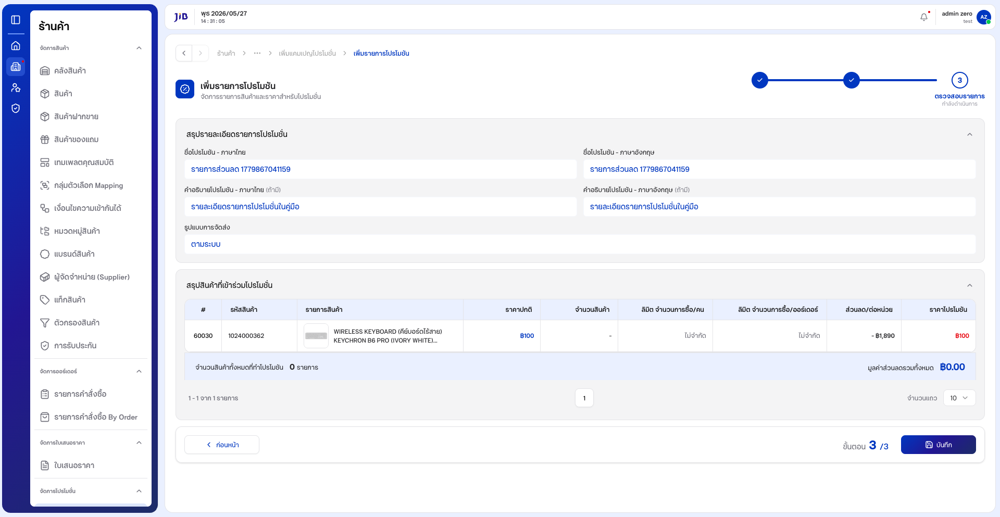

---

**2.3.4.4** คลิก **「บันทึก」** (มุมขวาล่าง) เพื่อบันทึกรายการโปรโมชั่น

**2.3.4.5** เมื่อสำเร็จ ระบบกลับมาหน้า **「เพิ่มแคมเปญโปรโมชั่น」** และแจ้ง **「เพิ่มรายการโปรโมชันสำเร็จ」** — รายการที่เพิ่มจะปรากฏในตาราง **「รายการโปรโมชั่น」**

**หน้าจอแคมเปญหลังเพิ่มรายการสำเร็จ**

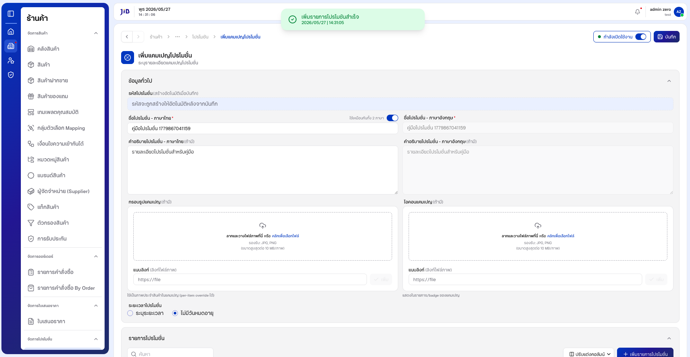

---

### 2.4 บันทึกแคมเปญและตรวจสอบในรายการ

**2.4.1** ตรวจสอบ **ข้อมูลทั่วไป** และ **รายการโปรโมชั่น** ในตารางให้ครบถ้วน

**2.4.2** คลิกปุ่ม **「บันทึก」** ที่แถบด้านบนของหน้า (ข้างสวิตช์สถานะ)

**2.4.3** หาก **มูลค่าส่วนลดรวมเป็น 0** ระบบจะแจ้ง **「มูลค่าส่วนลดต้องมากกว่า 0」** — ให้กลับไปแก้ราคา/ส่วนลดในรายการ (ขั้นตอน 2.3.3.6) แล้วบันทึกใหม่

**2.4.4** เมื่อบันทึกสำเร็จ ระบบแจ้ง **「สร้างโปรโมชันสำเร็จแล้ว」** และนำกลับ **หน้ารายการโปรโมชั่น**

**หน้าจอหลังบันทึกแคมเปญสำเร็จ (รายการ)**

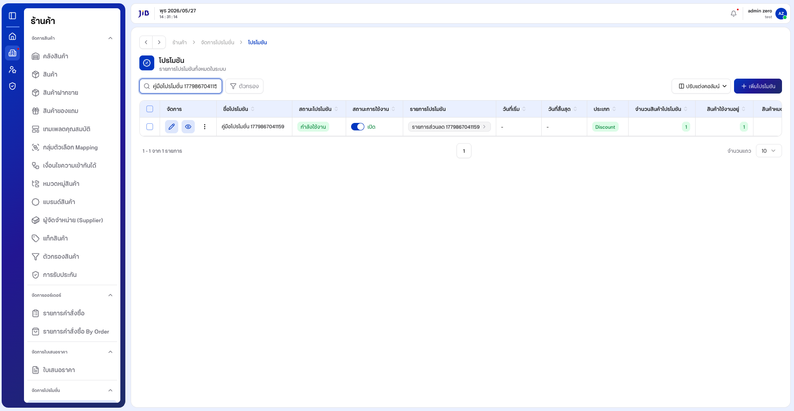

---

**2.4.5** ค้นหาชื่อแคมเปญในช่อง **「ค้นหาชื่อโปรโมชัน」** เพื่อยืนยันว่าแคมเปญปรากฏในตาราง พร้อมประเภท **Discount** และจำนวนสินค้าในโปรโมชันตามที่ตั้งค่า

---

## 3. การจัดการรายการในตาราง

### 3.1 ปรับแต่งคอลัมน์และจำนวนแถว

**3.1.1** คลิก **「ปรับแต่งคอลัมน์」** เพื่อเลือกคอลัมน์ที่ต้องการแสดง

**3.1.2** ที่ **「จำนวนแถว」** เลือก **10**, **20**, **50** หรือ **100** ตามต้องการ

**3.1.3** ใช้แถบ Pagination ด้านล่างเพื่อเปลี่ยนหน้า

---

## 4. เงื่อนไขและข้อควรระวัง

| ฟิลด์ / กรณี | รายละเอียด |
|--------------|------------|
| ชื่อโปรโมชัน (ภาษาไทย) | บังคับ — แจ้ง **กรุณากรอกชื่อโปรโมชัน** หากเว้นว่างแล้วกดบันทึก |
| ชื่อภาษาอังกฤษ | บังคับเมื่อปิด **ใช้เหมือนกันทั้ง 2 ภาษา** |
| รหัสโปรโมชั่น | ระบบสร้างอัตโนมัติเมื่อบันทึก |
| รูปแบบแคมเปญ | ต้องเลือกก่อนกด **ยืนยัน** — ปุ่มยืนยันจะ disabled จนกว่าจะเลือก |
| รายการโปรโมชั่น — ชื่อ | บังคับก่อนกด **ถัดไป** ขั้นตอน 1 |
| รายการโปรโมชั่น — สินค้า | ต้องเลือกอย่างน้อย 1 รายการในขั้นตอน 2 |
| รายการโปรโมชั่น — ส่วนลด | ต้องกำหนดราคา/ส่วนลดในตารางให้มูลค่ารวม > 0 ก่อนบันทึกแคมเปญ |
| บันทึกแคมเปญโดยไม่มีรายการ | ระบบอาจบันทึกได้แม้ไม่มีรายการ (ข้อจำกัดที่ควรทราบ) |
| บันทึกฟอร์มว่าง | ระบบยังอยู่หน้าสร้างและแสดงข้อความแจ้งเตือน |
| คำศัพท์ในระบบ | บางจุดใช้ **โปรโมชัน** และ **โปรโมชั่น** สลับกัน |

**หมายเหตุ:** ขั้นตอน Wizard รายการโปรโมชั่น (เลือกสินค้า / กำหนดราคา / ตรวจสอบ) อาจแตกต่างเล็กน้อยตามรูปแบบแคมเปญ (Bundle, Flash sale, Add on)

---

### อัปเดตภาพหน้าจอและ PDF

```bash
npm run manual:promotions
```

ภาพ: `docs/images/promotions/` · PDF: `docs/โปรโมชั่น-คู่มือผู้ใช้.pdf`
